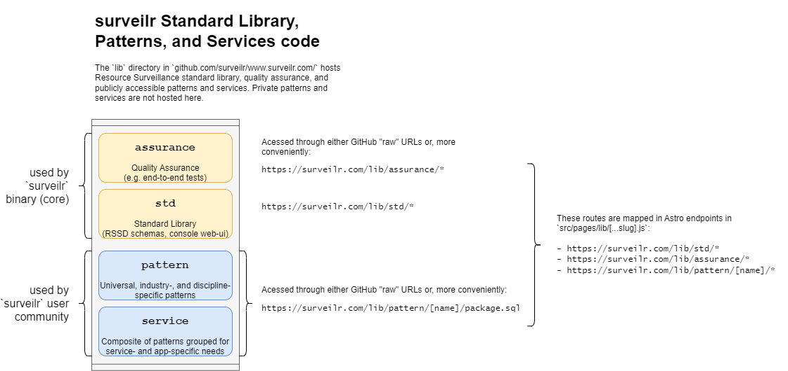
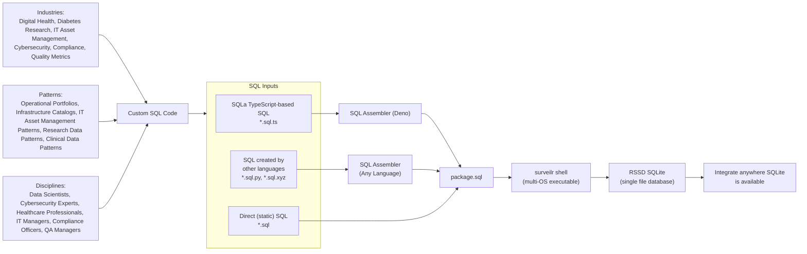

# `surveilr` Standard Library and Patterns

`surveilr`'s Standard Library (`std`) and Patterns are written in Deno-flavored TypeScript and **require Deno 1.40+** to run.

To understand terminology, see http://surveilr.com/blog/surveilr-core-vs-patterns/.





## `lib` Structure

```md
lib/
├── assurance/              Quality Assurance for surveilr
├── pattern/                All public patterns (composable)
│   ├── fhir-explorer/        FHIR Explorer Pattern
│   ├── osquery/              osQuery Integration pattern
│   └── (...)/                add more patterns above this one
├── service/                All public services (large combinations of patterns)
│   ├── drh/                  Diabetes Research Hub "Edge" Service
│   ├── opsfolio/             Opsfolio
│   └── (...)/                add more services above this one
├── std/                    surveilr Standard Library (used by all patterns)
│   ├── models/               RSSD schemas
│   ├── notebook/             Notebook schemas
│   ├── web-ui-content/       SQLPage content for Shell, Console, etc.
│   ├── deps.ts               Common Deno dependencies (used by all patterns)
│   └── package.sql.ts        Module to include in all other patterns
└── universal/              Universally applicable modules (can be used anywhere)
```

## Serving through `surveilr.com/lib/*`

The `src/pages/lib/[...slug].js` Astro endpoint serves all the content in this
directory as `/lib/*`:

- Any file can be served as-is by using it's direct relative path
- If a file name is of the format `*.sql.*` (ends in `.sql` plus another 
  extension like `*.sql.ts` or `.sql.sh`) then can be accessed without the
  second extension via just `*.sql`:
  - If the file has its executable bit set, it is executed and the result of
    STDOUT is returned as the URL's content
  - If the file does not have its executable bit set but ends in `.sql.ts`, it
    is executed via `deno -A <file>` and the result of STDOUT is captured an
    is returned as the URL's content

The `surveilr.com/lib/*` serving capability allows the following `surveilr` usage:

```bash
# if a file named `lib/pattern/fhir-explorer/package.sql.ts` is available then
# calling `package.sql` "executes" the `package.sql.ts` and returns just SQL
$ surveilr shell https://surveilr.com/lib/pattern/fhir-explorer/package.sql
```

You can also import `*.ts` files directly:

```bash
# if a file named `lib/pattern/fhir-explorer/package.sql.ts` is available then
# calling `package.sql.ts` allows importing in any Deno module:
$ deno run -A https://surveilr.com/lib/pattern/fhir-explorer/package.sql.ts
```

In summary:

- Using `https://surveilr.com/lib/pattern/fhir-explorer/package.sql.ts` emits
  the **TypeScript _source code_** (for example so it can be `import`ed into Deno).
- Using `https://surveilr.com/lib/pattern/fhir-explorer/package.sql` emits the
  the **SQL generated from executing TypeScript**.

## Automatically reloading SQL when it changes

On sandboxes during development and editing of `.sql` or `.sql.ts` you may want
to automatically re-load the contents into SQLite regularly. Since it can be
time-consuming to re-run the same command in the CLI manually each time a file
changes, you can use _watch mode_ instead.

See [`sqlpagectl.ts`](universal/sqlpagectl.ts) for usage instructions.