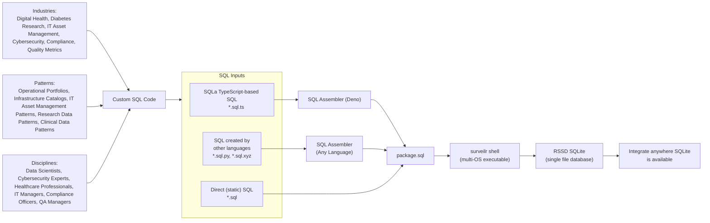

# `surveilr` Standard Library and Patterns

`surveilr`'s Standard Library (`std`) and Patterns are written in Deno-flavored
TypeScript and **require Deno 1.40+** to run.

To understand terminology, see
http://surveilr.com/blog/surveilr-core-vs-patterns/.




## `lib` Structure

```md
lib/
├── assurance/              Quality Assurance for surveilr
├── cookbook/               Small independent  "recipes" to explain common surveilr SQL usage
├── pattern/                All public patterns (composable) that are too big to put into a Cookbook
├── service/                All public services that are too big to put into a Pattern (might be a full "app" or "service")
├── std/                    surveilr Standard Library (used by all patterns)
└── universal/              Universally applicable modules (can be used anywhere, even outside of `surveilr` context)
```

## Serving through `surveilr.com/lib/*`

The `src/pages/lib/[...slug].js` Astro endpoint serves all the content in this
directory as `/lib/*`:

- Any file can be served as-is by using it's direct relative path
- If a file name is of the format `*.sql.*` (ends in `.sql` plus another
  extension like `*.sql.ts` or `.sql.sh`) then can be accessed without the
  second extension via just `*.sql`:
  - If the file has its executable bit set, it is executed and the result of
    STDOUT is returned as the URL's content
  - If the file does not have its executable bit set but ends in `.sql.ts`, it
    is executed via `deno -A <file>` and the result of STDOUT is captured an is
    returned as the URL's content

The `surveilr.com/lib/*` serving capability allows the following `surveilr`
usage:

```bash
# if a file named `lib/pattern/fhir-explorer/package.sql.ts` is available then
# calling `package.sql` "executes" the `package.sql.ts` and returns just SQL
$ surveilr shell https://surveilr.com/lib/pattern/fhir-explorer/package.sql
```

You can also import `*.ts` files directly:

```bash
# if a file named `lib/pattern/fhir-explorer/package.sql.ts` is available then
# calling `package.sql.ts` allows importing in any Deno module:
$ deno run -A https://surveilr.com/lib/pattern/fhir-explorer/package.sql.ts
```

In summary:

- Using `https://surveilr.com/lib/pattern/fhir-explorer/package.sql.ts` emits
  the **TypeScript _source code_** (for example so it can be `import`ed into
  Deno).
- Using `https://surveilr.com/lib/pattern/fhir-explorer/package.sql` emits the
  the **SQL generated from executing TypeScript**.

## Typical Usage of Patterns and other Standard Library content

Most patterns incorporate these common naming conventions for SQL source files:

- `package.sql.ts` script is the entry point for loading typical database
  objects and Web UI content. It is responsible for assembling dynamic SQL
  through TypeScript classes as well as combining the following files _when
  present_:
  - `stateless.sql` script focuses on creating views and database objects that
    do not alter the state of the RSSD. JSONB column. It does not modify or
    store any persistent data; it only sets up views for querying.
  - `orchestrate-stateful.sql` script focuses on creating tables and database
    objects (SQL DDL) and DML which changes the content of the RSSD.

Here's the typical usage when you're developing the code (just using it):

```bash
# use `surveilr ingest files` or other `surveilr ingest ...` commands to prepare RSSD
$ surveilr ingest files -r ingest/

# load any other tables, perform orchestration, and load Web UI content
$ surveilr shell https://surveilr.com/pattern/[name]/package.sql

# launch the web server to view the content on your local machine
$ surveilr web-ui --port 9000
# launch a browser and go to http://localhost:9000/
```

Here's the typical usage when you're developing patterns and services:

```bash
# load the "Console" and other menu/routing utilities plus FHIR Web UI (both are same, just run one)
$ deno run -A ./package.sql.ts | surveilr shell   # option 1 (same as option 2)
$ surveilr shell ./package.sql.ts                 # option 2 (same as option 1)

# if you want to start surveilr embedded Web UI in "watch" mode to re-load files automatically;
# by default it "watches" the current working directory's *.sql and *.sql.ts files and reloads
# ./package.sql.ts if any files change.
$ ../../std/surveilrctl.ts dev
# browse http://localhost:9000/ to see web UI
```

If you're an advanced user who knows how to use SQLPage and you want to start a
standalone SQLPage in "watch" mode to re-load files automatically:

```bash
$ ../../std/surveilrctl.ts dev --standalone
# browse http://localhost:9000/ to see web UI
```

## SQL Developers' Convenience: Automatically reloading SQL when it changes

On sandboxes during development and editing of `.sql` or `.sql.ts` you may want
to automatically re-load the contents into SQLite regularly. Since it can be
time-consuming to re-run the same command in the CLI manually each time a file
changes, you can use _watch mode_ instead.

See [`surveilrctl.ts`](std/surveilrctl.ts) for usage instructions.

## Reverse Proxy for Local Testing

This script acts as a lightweight HTTP reverse proxy, allowing you to test
services locally with simulated base URLs. It’s useful for testing service behavior
before setting up a full-fledged reverse proxy like NGINX.

The target service (e.g., SQLPage) must already be running and accessible.

```bash
$ deno run --allow-net reverse-proxy-simulate.ts <proxyPort> <targetBaseURL>
$ deno run --allow-net reverse-proxy-simulate.ts 8991 http://localhost:9000
# http://localhost:9000 is the target url where the service is up

```

