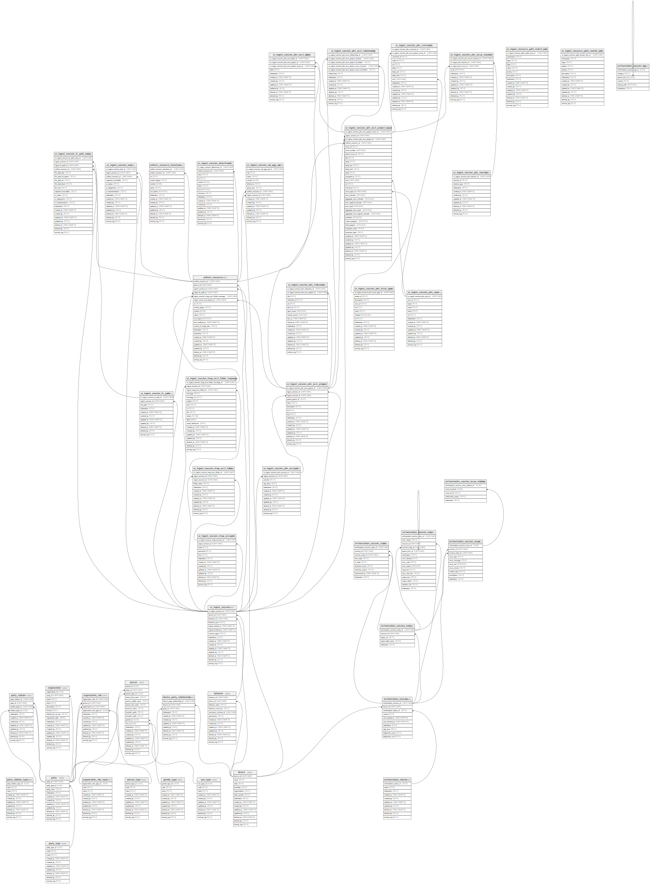

## Tables

| Name                                                                                                                                  | Columns | Comment                                                                                                                                                                                                                                                                                                                                                                                                                                                                                                                                                               | Type  |
| ------------------------------------------------------------------------------------------------------------------------------------- | ------- | --------------------------------------------------------------------------------------------------------------------------------------------------------------------------------------------------------------------------------------------------------------------------------------------------------------------------------------------------------------------------------------------------------------------------------------------------------------------------------------------------------------------------------------------------------------------- | ----- |
| [party_type](/docs/standard-library/rssd-schema/party_type)                                                                 | 3       |                                                                                                                                                                                                                                                                                                                                                                                                                                                                                                                                                                       | table |
| [party](/docs/standard-library/rssd-schema/party)                                                                           | 11      | Entity representing parties involved in business transactions.                                                                                                                                                                                                                                                                                                                                                                                                                                                                                                        | table |
| [party_relation_type](/docs/standard-library/rssd-schema/party_relation_type)                                               | 3       |                                                                                                                                                                                                                                                                                                                                                                                                                                                                                                                                                                       | table |
| [party_relation](/docs/standard-library/rssd-schema/party_relation)                                                         | 12      | Entity to define relationships between parties. Each party relation has a unique ID associated with it.                                                                                                                                                                                                                                                                                                                                                                                                                                                               | table |
| [gender_type](/docs/standard-library/rssd-schema/gender_type)                                                               | 3       |                                                                                                                                                                                                                                                                                                                                                                                                                                                                                                                                                                       | table |
| [person](/docs/standard-library/rssd-schema/person)                                                                         | 15      | Entity to store information about individuals as persons. Each person has a unique ID associated with them.                                                                                                                                                                                                                                                                                                                                                                                                                                                           | table |
| [organization](/docs/standard-library/rssd-schema/organization)                                                             | 15      | Entity to store information about organizations. Each organization has a unique ID associated with it.                                                                                                                                                                                                                                                                                                                                                                                                                                                                | table |
| [organization_role_type](/docs/standard-library/rssd-schema/organization_role_type)                                         | 3       |                                                                                                                                                                                                                                                                                                                                                                                                                                                                                                                                                                       | table |
| [organization_role](/docs/standard-library/rssd-schema/organization_role)                                                   | 12      | Entity to associate individuals with roles in organizations. Each organization role has a unique ID associated with it.                                                                                                                                                                                                                                                                                                                                                                                                                                               | table |
| [device](/docs/standard-library/rssd-schema/device)                                                                         | 14      | Identity, network segmentation, and sysinfo for devices on which uniform_resource are found                                                                                                                                                                                                                                                                                                                                                                                                                                                                           | table |
| [device_party_relationship](/docs/standard-library/rssd-schema/device_party_relationship)                                   | 11      | Entity to define relationships between multiple tenants to multiple devices                                                                                                                                                                                                                                                                                                                                                                                                                                                                                           | table |
| [behavior](/docs/standard-library/rssd-schema/behavior)                                                                     | 13      | Behaviors are configuration "presets" that can be used to drive application operations at runtime. For example, ingest behaviors include configs that indicate which files to ignore, which to scan, when to load content, etc. This is more convenient than creating  behavior has a foreign key reference to the device table since behaviors might be device-specific.                                                                                                                                                                        | table |
| [ur_ingest_resource_path_match_rule](/docs/standard-library/rssd-schema/ur_ingest_resource_path_match_rule)                 | 15      | A regular expression can determine the flags to apply to an ingestion path and if the regular expr contains a nature capture group that pattern match will assign the nature too.                                                                                                                                                                                                                                                                                                                                                                               | table |
| [ur_ingest_resource_path_rewrite_rule](/docs/standard-library/rssd-schema/ur_ingest_resource_path_rewrite_rule)             | 14      | A regular expression can determine whether certain paths should be rewritten before ur_ingest_resource_path_match_rule matches occur.                                                                                                                                                                                                                                                                                                                                                                                                                              | table |
| [ur_ingest_session](/docs/standard-library/rssd-schema/ur_ingest_session)                                                   | 15      | Immutable ingestion sessions represents any "discovery" or "walk" operation. This could be a device file system scan or any other resource discovery session. Each time a discovery operation starts, a record is created. ur_ingest_session has a foreign key reference to the device table so that the same device can be used for multiple ingest sessions but also the ingest sessions can be merged across workstations / servers for easier detection of changes and similaries between file systems on different devices.                                      | table |
| [ur_ingest_session_fs_path](/docs/standard-library/rssd-schema/ur_ingest_session_fs_path)                                   | 11      | Immutable ingest session file system path represents a discovery or "walk" path. If the session included a file system scan, then root_path is the root file system path that was scanned. If the session was discovering resources in another target then root_path would be representative of the target path (could be a URI).                                                                                                                                                                                                                                     | table |
| [uniform_resource](/docs/standard-library/rssd-schema/uniform_resource)                                                     | 22      | Immutable resource and content information. On multiple executions, uniform_resource are inserted only if the the content (see unique index for details). For historical logging, uniform_resource has foreign key references to both ur_ingest_session and ur_ingest_session_fs_path tables to indicate which particular session and ingestion path the resourced was inserted during.                                                                                                                                                                | table |
| [uniform_resource_transform](/docs/standard-library/rssd-schema/uniform_resource_transform)                                 | 15      | uniform_resource transformed content                                                                                                                                                                                                                                                                                                                                                                                                                                                                                                                                  | table |
| [ur_ingest_session_fs_path_entry](/docs/standard-library/rssd-schema/ur_ingest_session_fs_path_entry)                       | 21      | Contains entries related to file system content ingestion paths. On multiple executions, unlike uniform_resource, ur_ingest_session_fs_path_entry rows are always inserted and references the uniform_resource primary key of its related content. This method allows for a more efficient query of file version differences across sessions. With SQL queries, you can detect which sessions have a file added or modified, which sessions have a file deleted, and what the differences are in file contents if they were modified across sessions.                 | table |
| [ur_ingest_session_task](/docs/standard-library/rssd-schema/ur_ingest_session_task)                                         | 15      | Contains entries related to task content ingestion paths. On multiple executions, unlike uniform_resource, ur_ingest_session_task rows are always inserted and references the uniform_resource primary key of its related content. This method allows for a more efficient query of file version differences across sessions. With SQL queries, you can detect which sessions have a file added or modified, which sessions have a file deleted, and what the differences are in file contents if they were modified across sessions.                                 | table |
| [ur_ingest_session_imap_account](/docs/standard-library/rssd-schema/ur_ingest_session_imap_account)                         | 13      | Immutable ingest session folder system represents an email address to be ingested. Each session includes an email, then email is the folder that was scanned.                                                                                                                                                                                                                                                                                                                                                                                                         | table |
| [ur_ingest_session_imap_acct_folder](/docs/standard-library/rssd-schema/ur_ingest_session_imap_acct_folder)                 | 12      | Immutable ingest session folder system represents a folder or mailbox in an email account, e.g. "INBOX" or "SENT". Each session includes a folder scan, then folder_name is the folder that was scanned.                                                                                                                                                                                                                                                                                                                                                              | table |
| [ur_ingest_session_imap_acct_folder_message](/docs/standard-library/rssd-schema/ur_ingest_session_imap_acct_folder_message) | 20      | Contains messages related in a folder that was ingested. On multiple executions, unlike uniform_resource, ur_ingest_session_imap_acct_folder_message rows are always inserted and references the uniform_resource primary key of its related content. This method allows for a more efficient query of message version differences across sessions. With SQL queries, you can detect which sessions have a messaged added or modified, which sessions have a message deleted, and what the differences are in message contents if they were modified across sessions. | table |
| [ur_ingest_session_plm_account](/docs/standard-library/rssd-schema/ur_ingest_session_plm_account)                           | 12      | Immutable ingest session folder system represents an organisation issues to be ingested. Each session includes an organisation, then org_name is the folder that was scanned.                                                                                                                                                                                                                                                                                                                                                                                         | table |
| [ur_ingest_session_plm_acct_project](/docs/standard-library/rssd-schema/ur_ingest_session_plm_acct_project)                 | 16      | Immutable ingest session folder system represents an organisation issues to be ingested. Each session includes an organisation, then name is the folder that was scanned.                                                                                                                                                                                                                                                                                                                                                                                             | table |
| [ur_ingest_session_plm_acct_project_issue](/docs/standard-library/rssd-schema/ur_ingest_session_plm_acct_project_issue)     | 35      | Contains messages related in a folder that was ingested. On multiple executions, unlike uniform_resource, ur_ingest_session_plm_acct_project_issue rows are always inserted and references the uniform_resource primary key of its related content. This method allows for a more efficient query of message version differences across sessions. With SQL queries, you can detect which sessions have a messaged added or modified, which sessions have a message deleted, and what the differences are in message contents if they were modified across sessions.   | table |
| [ur_ingest_session_plm_acct_label](/docs/standard-library/rssd-schema/ur_ingest_session_plm_acct_label)                     | 12      |                                                                                                                                                                                                                                                                                                                                                                                                                                                                                                                                                                       | table |
| [ur_ingest_session_plm_milestone](/docs/standard-library/rssd-schema/ur_ingest_session_plm_milestone)                       | 18      |                                                                                                                                                                                                                                                                                                                                                                                                                                                                                                                                                                       | table |
| [ur_ingest_session_plm_acct_relationship](/docs/standard-library/rssd-schema/ur_ingest_session_plm_acct_relationship)       | 14      |                                                                                                                                                                                                                                                                                                                                                                                                                                                                                                                                                                       | table |
| [ur_ingest_session_plm_user](/docs/standard-library/rssd-schema/ur_ingest_session_plm_user)                                 | 14      |                                                                                                                                                                                                                                                                                                                                                                                                                                                                                                                                                                       | table |
| [ur_ingest_session_plm_comment](/docs/standard-library/rssd-schema/ur_ingest_session_plm_comment)                           | 17      |                                                                                                                                                                                                                                                                                                                                                                                                                                                                                                                                                                       | table |
| [ur_ingest_session_plm_reaction](/docs/standard-library/rssd-schema/ur_ingest_session_plm_reaction)                         | 11      |                                                                                                                                                                                                                                                                                                                                                                                                                                                                                                                                                                       | table |
| [ur_ingest_session_plm_issue_reaction](/docs/standard-library/rssd-schema/ur_ingest_session_plm_issue_reaction)             | 12      |                                                                                                                                                                                                                                                                                                                                                                                                                                                                                                                                                                       | table |
| [ur_ingest_session_plm_issue_type](/docs/standard-library/rssd-schema/ur_ingest_session_plm_issue_type)                     | 16      |                                                                                                                                                                                                                                                                                                                                                                                                                                                                                                                                                                       | table |
| [ur_ingest_session_attachment](/docs/standard-library/rssd-schema/ur_ingest_session_attachment)                             | 16      | uniform_resource transformed content                                                                                                                                                                                                                                                                                                                                                                                                                                                                                                                                  | table |
| [ur_ingest_session_udi_pgp_sql](/docs/standard-library/rssd-schema/ur_ingest_session_udi_pgp_sql)                           | 15      | UDI PGP stored response                                                                                                                                                                                                                                                                                                                                                                                                                                                                                                                                               | table |
| [orchestration_nature](/docs/standard-library/rssd-schema/orchestration_nature)                                             | 10      | Entity to define relationships between multiple tenants to multiple devices                                                                                                                                                                                                                                                                                                                                                                                                                                                                                           | table |
| [orchestration_session](/docs/standard-library/rssd-schema/orchestration_session)                                           | 10      | An orchestration session groups multiple orchestration events for reporting or other purposes                                                                                                                                                                                                                                                                                                                                                                                                                                                                         | table |
| [orchestration_session_entry](/docs/standard-library/rssd-schema/orchestration_session_entry)                               | 5       | An orchestration session entry records a specific file that that is ingested or otherwise orchestrated                                                                                                                                                                                                                                                                                                                                                                                                                                                                | table |
| [orchestration_session_state](/docs/standard-library/rssd-schema/orchestration_session_state)                               | 9       | Records the state of an orchestration session, computations, and results for Kernels that are stateful. For example, a SQL Notebook Cell that creates tables should only be run once (meaning it's stateful). Other Kernels might store results for functions and output defined in one cell can be used in later cells.                                                                                                                                                                                                                                              | table |
| [orchestration_session_exec](/docs/standard-library/rssd-schema/orchestration_session_exec)                                 | 15      | Records the state of an orchestration session command or other execution.                                                                                                                                                                                                                                                                                                                                                                                                                                                                                             | table |
| [orchestration_session_issue](/docs/standard-library/rssd-schema/orchestration_session_issue)                               | 10      | An orchestration issue is generated when an error or warning needs to be created during the orchestration of an entry in a session.                                                                                                                                                                                                                                                                                                                                                                                                                                | table |
| [orchestration_session_issue_relation](/docs/standard-library/rssd-schema/orchestration_session_issue_relation)             | 5       | An orchestration issue is generated when an error or warning needs to be created during the orchestration of an entry in a session.                                                                                                                                                                                                                                                                                                                                                                                                                                | table |
| [orchestration_session_log](/docs/standard-library/rssd-schema/orchestration_session_log)                                   | 6       | An orchestration issue is generated when an error or warning needs to be created during the orchestration of an entry in a session.                                                                                                                                                                                                                                                                                                                                                                                                                                | table |

## Relations

