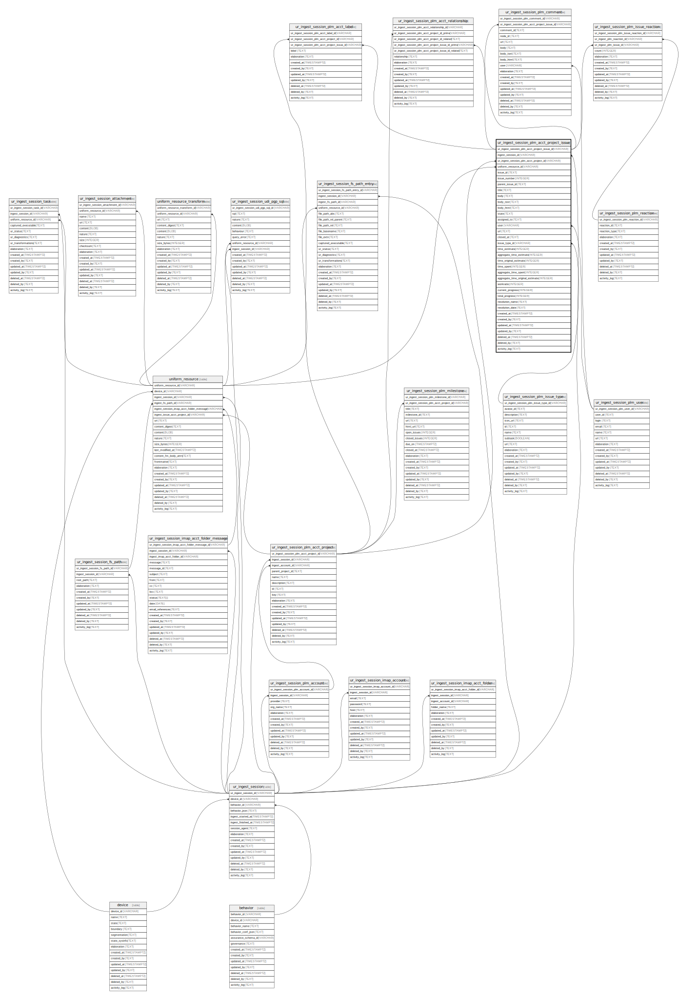

## Description

Contains messages related in a folder that was ingested. On multiple executions,
unlike uniform_resource, ur_ingest_session_plm_acct_project_issue rows are
always inserted and references the uniform_resource primary key of its related
content. This method allows for a more efficient query of message version
differences across sessions. With SQL queries, you can detect which sessions
have a messaged added or modified, which sessions have a message deleted, and
what the differences are in message contents if they were modified across
sessions.

<details>
<summary><strong>Table Definition</strong></summary>

```sql
CREATE TABLE "ur_ingest_session_plm_acct_project_issue" (
    "ur_ingest_session_plm_acct_project_issue_id" VARCHAR PRIMARY KEY NOT NULL,
    "ingest_session_id" VARCHAR NOT NULL,
    "ur_ingest_session_plm_acct_project_id" VARCHAR NOT NULL,
    "uniform_resource_id" VARCHAR,
    "issue_id" TEXT NOT NULL,
    "issue_number" INTEGER,
    "parent_issue_id" TEXT,
    "title" TEXT NOT NULL,
    "body" TEXT,
    "body_text" TEXT,
    "body_html" TEXT,
    "state" TEXT NOT NULL,
    "assigned_to" TEXT NOT NULL,
    "user" VARCHAR NOT NULL,
    "url" TEXT NOT NULL,
    "closed_at" TEXT,
    "issue_type_id" VARCHAR,
    "time_estimate" INTEGER,
    "aggregate_time_estimate" INTEGER,
    "time_original_estimate" INTEGER,
    "time_spent" INTEGER,
    "aggregate_time_spent" INTEGER,
    "aggregate_time_original_estimate" INTEGER,
    "workratio" INTEGER,
    "current_progress" INTEGER,
    "total_progress" INTEGER,
    "resolution_name" TEXT,
    "resolution_date" TEXT,
    "created_at" TIMESTAMPTZ DEFAULT CURRENT_TIMESTAMP,
    "created_by" TEXT DEFAULT 'UNKNOWN',
    "updated_at" TIMESTAMPTZ,
    "updated_by" TEXT,
    "deleted_at" TIMESTAMPTZ,
    "deleted_by" TEXT,
    "activity_log" TEXT,
    FOREIGN KEY("ingest_session_id") REFERENCES "ur_ingest_session"("ur_ingest_session_id"),
    FOREIGN KEY("ur_ingest_session_plm_acct_project_id") REFERENCES "ur_ingest_session_plm_acct_project"("ur_ingest_session_plm_acct_project_id"),
    FOREIGN KEY("uniform_resource_id") REFERENCES "uniform_resource"("uniform_resource_id"),
    FOREIGN KEY("user") REFERENCES "ur_ingest_session_plm_user"("ur_ingest_session_plm_user_id"),
    FOREIGN KEY("issue_type_id") REFERENCES "ur_ingest_session_plm_issue_type"("ur_ingest_session_plm_issue_type_id"),
    UNIQUE("title", "issue_id", "body", "state", "assigned_to", "issue_number")
)
```

</details>

## Columns

| Name                                        | Type        | Default           | Nullable | Children                                                                                                                                                                                                                                                                                                                                                                                                                                                                                | Parents                                                                                                               | Comment                                                 |
| ------------------------------------------- | ----------- | ----------------- | -------- | --------------------------------------------------------------------------------------------------------------------------------------------------------------------------------------------------------------------------------------------------------------------------------------------------------------------------------------------------------------------------------------------------------------------------------------------------------------------------------------- | --------------------------------------------------------------------------------------------------------------------- | ------------------------------------------------------- |
| ur_ingest_session_plm_acct_project_issue_id | VARCHAR     |                   | false    | [ur_ingest_session_plm_acct_label](/docs/standard-library/rssd-schema/ur_ingest_session_plm_acct_label) [ur_ingest_session_plm_acct_relationship](/docs/standard-library/rssd-schema/ur_ingest_session_plm_acct_relationship) [ur_ingest_session_plm_comment](/docs/standard-library/rssd-schema/ur_ingest_session_plm_comment) [ur_ingest_session_plm_issue_reaction](/docs/standard-library/rssd-schema/ur_ingest_session_plm_issue_reaction) |                                                                                                                       | {"isSqlDomainZodDescrMeta":true,"isVarChar":true}       |
| ingest_session_id                           | VARCHAR     |                   | false    |                                                                                                                                                                                                                                                                                                                                                                                                                                                                                         | [ur_ingest_session](/docs/standard-library/rssd-schema/ur_ingest_session)                                   | {"isSqlDomainZodDescrMeta":true,"isVarChar":true}       |
| ur_ingest_session_plm_acct_project_id       | VARCHAR     |                   | false    |                                                                                                                                                                                                                                                                                                                                                                                                                                                                                         | [ur_ingest_session_plm_acct_project](/docs/standard-library/rssd-schema/ur_ingest_session_plm_acct_project) | {"isSqlDomainZodDescrMeta":true,"isVarChar":true}       |
| uniform_resource_id                         | VARCHAR     |                   | true     |                                                                                                                                                                                                                                                                                                                                                                                                                                                                                         | [uniform_resource](/docs/standard-library/rssd-schema/uniform_resource)                                     | {"isSqlDomainZodDescrMeta":true,"isVarChar":true}       |
| issue_id                                    | TEXT        |                   | false    |                                                                                                                                                                                                                                                                                                                                                                                                                                                                                         |                                                                                                                       |                                                         |
| issue_number                                | INTEGER     |                   | true     |                                                                                                                                                                                                                                                                                                                                                                                                                                                                                         |                                                                                                                       |                                                         |
| parent_issue_id                             | TEXT        |                   | true     |                                                                                                                                                                                                                                                                                                                                                                                                                                                                                         |                                                                                                                       |                                                         |
| title                                       | TEXT        |                   | false    |                                                                                                                                                                                                                                                                                                                                                                                                                                                                                         |                                                                                                                       |                                                         |
| body                                        | TEXT        |                   | true     |                                                                                                                                                                                                                                                                                                                                                                                                                                                                                         |                                                                                                                       |                                                         |
| body_text                                   | TEXT        |                   | true     |                                                                                                                                                                                                                                                                                                                                                                                                                                                                                         |                                                                                                                       |                                                         |
| body_html                                   | TEXT        |                   | true     |                                                                                                                                                                                                                                                                                                                                                                                                                                                                                         |                                                                                                                       |                                                         |
| state                                       | TEXT        |                   | false    |                                                                                                                                                                                                                                                                                                                                                                                                                                                                                         |                                                                                                                       |                                                         |
| assigned_to                                 | TEXT        |                   | false    |                                                                                                                                                                                                                                                                                                                                                                                                                                                                                         |                                                                                                                       |                                                         |
| user                                        | VARCHAR     |                   | false    |                                                                                                                                                                                                                                                                                                                                                                                                                                                                                         | [ur_ingest_session_plm_user](/docs/standard-library/rssd-schema/ur_ingest_session_plm_user)                 | {"isSqlDomainZodDescrMeta":true,"isVarChar":true}       |
| url                                         | TEXT        |                   | false    |                                                                                                                                                                                                                                                                                                                                                                                                                                                                                         |                                                                                                                       |                                                         |
| closed_at                                   | TEXT        |                   | true     |                                                                                                                                                                                                                                                                                                                                                                                                                                                                                         |                                                                                                                       |                                                         |
| issue_type_id                               | VARCHAR     |                   | true     |                                                                                                                                                                                                                                                                                                                                                                                                                                                                                         | [ur_ingest_session_plm_issue_type](/docs/standard-library/rssd-schema/ur_ingest_session_plm_issue_type)     | {"isSqlDomainZodDescrMeta":true,"isVarChar":true}       |
| time_estimate                               | INTEGER     |                   | true     |                                                                                                                                                                                                                                                                                                                                                                                                                                                                                         |                                                                                                                       |                                                         |
| aggregate_time_estimate                     | INTEGER     |                   | true     |                                                                                                                                                                                                                                                                                                                                                                                                                                                                                         |                                                                                                                       |                                                         |
| time_original_estimate                      | INTEGER     |                   | true     |                                                                                                                                                                                                                                                                                                                                                                                                                                                                                         |                                                                                                                       |                                                         |
| time_spent                                  | INTEGER     |                   | true     |                                                                                                                                                                                                                                                                                                                                                                                                                                                                                         |                                                                                                                       |                                                         |
| aggregate_time_spent                        | INTEGER     |                   | true     |                                                                                                                                                                                                                                                                                                                                                                                                                                                                                         |                                                                                                                       |                                                         |
| aggregate_time_original_estimate            | INTEGER     |                   | true     |                                                                                                                                                                                                                                                                                                                                                                                                                                                                                         |                                                                                                                       |                                                         |
| workratio                                   | INTEGER     |                   | true     |                                                                                                                                                                                                                                                                                                                                                                                                                                                                                         |                                                                                                                       |                                                         |
| current_progress                            | INTEGER     |                   | true     |                                                                                                                                                                                                                                                                                                                                                                                                                                                                                         |                                                                                                                       |                                                         |
| total_progress                              | INTEGER     |                   | true     |                                                                                                                                                                                                                                                                                                                                                                                                                                                                                         |                                                                                                                       |                                                         |
| resolution_name                             | TEXT        |                   | true     |                                                                                                                                                                                                                                                                                                                                                                                                                                                                                         |                                                                                                                       |                                                         |
| resolution_date                             | TEXT        |                   | true     |                                                                                                                                                                                                                                                                                                                                                                                                                                                                                         |                                                                                                                       |                                                         |
| created_at                                  | TIMESTAMPTZ | CURRENT_TIMESTAMP | true     |                                                                                                                                                                                                                                                                                                                                                                                                                                                                                         |                                                                                                                       |                                                         |
| created_by                                  | TEXT        | 'UNKNOWN'         | true     |                                                                                                                                                                                                                                                                                                                                                                                                                                                                                         |                                                                                                                       |                                                         |
| updated_at                                  | TIMESTAMPTZ |                   | true     |                                                                                                                                                                                                                                                                                                                                                                                                                                                                                         |                                                                                                                       |                                                         |
| updated_by                                  | TEXT        |                   | true     |                                                                                                                                                                                                                                                                                                                                                                                                                                                                                         |                                                                                                                       |                                                         |
| deleted_at                                  | TIMESTAMPTZ |                   | true     |                                                                                                                                                                                                                                                                                                                                                                                                                                                                                         |                                                                                                                       |                                                         |
| deleted_by                                  | TEXT        |                   | true     |                                                                                                                                                                                                                                                                                                                                                                                                                                                                                         |                                                                                                                       |                                                         |
| activity_log                                | TEXT        |                   | true     |                                                                                                                                                                                                                                                                                                                                                                                                                                                                                         |                                                                                                                       | {"isSqlDomainZodDescrMeta":true,"isJsonSqlDomain":true} |

## Constraints

| Name                                                        | Type        | Definition                                                                                                                                                                                   |
| ----------------------------------------------------------- | ----------- | -------------------------------------------------------------------------------------------------------------------------------------------------------------------------------------------- |
| ur_ingest_session_plm_acct_project_issue_id                 | PRIMARY KEY | PRIMARY KEY (ur_ingest_session_plm_acct_project_issue_id)                                                                                                                                    |
| - (Foreign key ID: 0)                                       | FOREIGN KEY | FOREIGN KEY (issue_type_id) REFERENCES ur_ingest_session_plm_issue_type (ur_ingest_session_plm_issue_type_id) ON UPDATE NO ACTION ON DELETE NO ACTION MATCH NONE                             |
| - (Foreign key ID: 1)                                       | FOREIGN KEY | FOREIGN KEY (user) REFERENCES ur_ingest_session_plm_user (ur_ingest_session_plm_user_id) ON UPDATE NO ACTION ON DELETE NO ACTION MATCH NONE                                                  |
| - (Foreign key ID: 2)                                       | FOREIGN KEY | FOREIGN KEY (uniform_resource_id) REFERENCES uniform_resource (uniform_resource_id) ON UPDATE NO ACTION ON DELETE NO ACTION MATCH NONE                                                       |
| - (Foreign key ID: 3)                                       | FOREIGN KEY | FOREIGN KEY (ur_ingest_session_plm_acct_project_id) REFERENCES ur_ingest_session_plm_acct_project (ur_ingest_session_plm_acct_project_id) ON UPDATE NO ACTION ON DELETE NO ACTION MATCH NONE |
| - (Foreign key ID: 4)                                       | FOREIGN KEY | FOREIGN KEY (ingest_session_id) REFERENCES ur_ingest_session (ur_ingest_session_id) ON UPDATE NO ACTION ON DELETE NO ACTION MATCH NONE                                                       |
| sqlite_autoindex_ur_ingest_session_plm_acct_project_issue_2 | UNIQUE      | UNIQUE (title, issue_id, body, state, assigned_to, issue_number)                                                                                                                             |
| sqlite_autoindex_ur_ingest_session_plm_acct_project_issue_1 | PRIMARY KEY | PRIMARY KEY (ur_ingest_session_plm_acct_project_issue_id)                                                                                                                                    |

## Indexes

| Name                                                            | Definition                                                                                                                                        |
| --------------------------------------------------------------- | ------------------------------------------------------------------------------------------------------------------------------------------------- |
| idx_ur_ingest_session_plm_acct_project_issue__ingest_session_id | CREATE INDEX "idx_ur_ingest_session_plm_acct_project_issue__ingest_session_id" ON "ur_ingest_session_plm_acct_project_issue"("ingest_session_id") |
| sqlite_autoindex_ur_ingest_session_plm_acct_project_issue_2     | UNIQUE (title, issue_id, body, state, assigned_to, issue_number)                                                                                  |
| sqlite_autoindex_ur_ingest_session_plm_acct_project_issue_1     | PRIMARY KEY (ur_ingest_session_plm_acct_project_issue_id)                                                                                         |

## Relations


