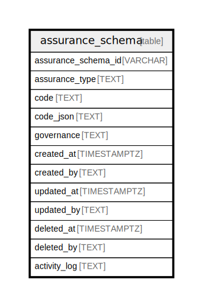

## Description

A Notebook is a group of Cells. A kernel is a computational engine that executes the code contained in a notebook cell.  Each notebook is associated with a kernel of a specific programming language or code transformer which can interpret  code and produce a result. For example, a SQL notebook might use a SQLite kernel for running SQL code and an AI Prompt  might prepare AI prompts for LLMs.

<details>
<summary><strong>Table Definition</strong></summary>

```sql
CREATE TABLE "assurance_schema" (
    "assurance_schema_id" VARCHAR PRIMARY KEY NOT NULL,
    "assurance_type" TEXT NOT NULL,
    "code" TEXT NOT NULL,
    "code_json" TEXT CHECK(json_valid(code_json) OR code_json IS NULL),
    "governance" TEXT CHECK(json_valid(governance) OR governance IS NULL),
    "created_at" TIMESTAMP DEFAULT CURRENT_TIMESTAMP,
    "created_by" TEXT DEFAULT 'UNKNOWN',
    "updated_at" TIMESTAMP,
    "updated_by" TEXT,
    "deleted_at" TIMESTAMP,
    "deleted_by" TEXT,
    "activity_log" TEXT
)
```

</details>

## Columns

| Name                | Type      | Default           | Nullable | Comment                                                                                |
| ------------------- | --------- | ----------------- | -------- | -------------------------------------------------------------------------------------- |
| assurance_schema_id | VARCHAR   |                   | false    | assurance_schema primary key and internal label (not a ULID)                           |
| assurance_type      | TEXT      |                   | false    | 'JSON Schema', 'XML Schema', etc.                                                      |
| code                | TEXT      |                   | false    | If the schema is other than JSON Schema, use this for the validation code              |
| code_json           | TEXT      |                   | true     | If the schema is a JSON Schema or the assurance code has a JSON representation         |
| governance          | TEXT      |                   | true     | JSON schema-specific governance data (description, documentation, usage, etc. in JSON) |
| created_at          | TIMESTAMP | CURRENT_TIMESTAMP | true     |                                                                                        |
| created_by          | TEXT      | 'UNKNOWN'         | true     |                                                                                        |
| updated_at          | TIMESTAMP |                   | true     |                                                                                        |
| updated_by          | TEXT      |                   | true     |                                                                                        |
| deleted_at          | TIMESTAMP |                   | true     |                                                                                        |
| deleted_by          | TEXT      |                   | true     |                                                                                        |
| activity_log        | TEXT      |                   | true     | {"isSqlDomainZodDescrMeta":true,"isJsonSqlDomain":true}                                |

## Constraints

| Name                                | Type        | Definition                                          |
| ----------------------------------- | ----------- | --------------------------------------------------- |
| assurance_schema_id                 | PRIMARY KEY | PRIMARY KEY (assurance_schema_id)                   |
| sqlite_autoindex_assurance_schema_1 | PRIMARY KEY | PRIMARY KEY (assurance_schema_id)                   |
| -                                   | CHECK       | CHECK(json_valid(code_json) OR code_json IS NULL)   |
| -                                   | CHECK       | CHECK(json_valid(governance) OR governance IS NULL) |

## Indexes

| Name                                | Definition                        |
| ----------------------------------- | --------------------------------- |
| sqlite_autoindex_assurance_schema_1 | PRIMARY KEY (assurance_schema_id) |

## Relations


