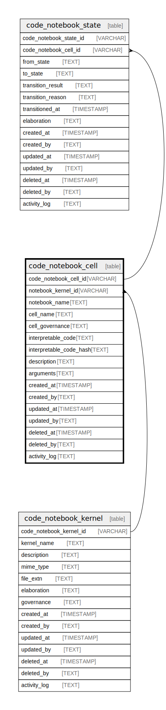

## Description

Each Notebook is divided into cells, which are individual units of interpretable code.  The content of Cells depends on the Notebook Kernel and contain the source code to be  executed by the Notebook's Kernel. The output of the code (text, graphics, etc.) can be  stateless or may be stateful and store its results and state transitions in code_notebook_state.

<details>
<summary><strong>Table Definition</strong></summary>

```sql
CREATE TABLE "code_notebook_cell" (
    "code_notebook_cell_id" VARCHAR PRIMARY KEY NOT NULL,
    "notebook_kernel_id" VARCHAR NOT NULL,
    "notebook_name" TEXT NOT NULL,
    "cell_name" TEXT NOT NULL,
    "cell_governance" TEXT CHECK(json_valid(cell_governance) OR cell_governance IS NULL),
    "interpretable_code" TEXT NOT NULL,
    "interpretable_code_hash" TEXT NOT NULL,
    "description" TEXT,
    "arguments" TEXT CHECK(json_valid(arguments) OR arguments IS NULL),
    "created_at" TIMESTAMP DEFAULT CURRENT_TIMESTAMP,
    "created_by" TEXT DEFAULT 'UNKNOWN',
    "updated_at" TIMESTAMP,
    "updated_by" TEXT,
    "deleted_at" TIMESTAMP,
    "deleted_by" TEXT,
    "activity_log" TEXT,
    FOREIGN KEY("notebook_kernel_id") REFERENCES "code_notebook_kernel"("code_notebook_kernel_id"),
    UNIQUE("notebook_name", "cell_name", "interpretable_code_hash")
)
```

</details>

## Columns

| Name                    | Type      | Default           | Nullable | Children                                      | Parents                                         | Comment                                                                                           |
| ----------------------- | --------- | ----------------- | -------- | --------------------------------------------- | ----------------------------------------------- | ------------------------------------------------------------------------------------------------- |
| code_notebook_cell_id   | VARCHAR   |                   | false    | [code_notebook_state](/docs/standard-library/notebooks-schema/code_notebook_state) |                                                 | code_notebook_cell primary key                                                                    |
| notebook_kernel_id      | VARCHAR   |                   | false    |                                               | [code_notebook_kernel](/docs/standard-library/notebooks-schema/code_notebook_kernel) | {"isSqlDomainZodDescrMeta":true,"isVarChar":true}                                                 |
| notebook_name           | TEXT      |                   | false    |                                               |                                                 |                                                                                                   |
| cell_name               | TEXT      |                   | false    |                                               |                                                 |                                                                                                   |
| cell_governance         | TEXT      |                   | true     |                                               |                                                 | any idempotency, versioning, hash, branch, tag or other "governance" data (dependent on the cell) |
| interpretable_code      | TEXT      |                   | false    |                                               |                                                 |                                                                                                   |
| interpretable_code_hash | TEXT      |                   | false    |                                               |                                                 |                                                                                                   |
| description             | TEXT      |                   | true     |                                               |                                                 |                                                                                                   |
| arguments               | TEXT      |                   | true     |                                               |                                                 | {"isSqlDomainZodDescrMeta":true,"isJsonText":true}                                                |
| created_at              | TIMESTAMP | CURRENT_TIMESTAMP | true     |                                               |                                                 |                                                                                                   |
| created_by              | TEXT      | 'UNKNOWN'         | true     |                                               |                                                 |                                                                                                   |
| updated_at              | TIMESTAMP |                   | true     |                                               |                                                 |                                                                                                   |
| updated_by              | TEXT      |                   | true     |                                               |                                                 |                                                                                                   |
| deleted_at              | TIMESTAMP |                   | true     |                                               |                                                 |                                                                                                   |
| deleted_by              | TEXT      |                   | true     |                                               |                                                 |                                                                                                   |
| activity_log            | TEXT      |                   | true     |                                               |                                                 | {"isSqlDomainZodDescrMeta":true,"isJsonSqlDomain":true}                                           |

## Constraints

| Name                                  | Type        | Definition                                                                                                                                    |
| ------------------------------------- | ----------- | --------------------------------------------------------------------------------------------------------------------------------------------- |
| code_notebook_cell_id                 | PRIMARY KEY | PRIMARY KEY (code_notebook_cell_id)                                                                                                           |
| - (Foreign key ID: 0)                 | FOREIGN KEY | FOREIGN KEY (notebook_kernel_id) REFERENCES code_notebook_kernel (code_notebook_kernel_id) ON UPDATE NO ACTION ON DELETE NO ACTION MATCH NONE |
| sqlite_autoindex_code_notebook_cell_2 | UNIQUE      | UNIQUE (notebook_name, cell_name, interpretable_code_hash)                                                                                    |
| sqlite_autoindex_code_notebook_cell_1 | PRIMARY KEY | PRIMARY KEY (code_notebook_cell_id)                                                                                                           |
| -                                     | CHECK       | CHECK(json_valid(cell_governance) OR cell_governance IS NULL)                                                                                 |
| -                                     | CHECK       | CHECK(json_valid(arguments) OR arguments IS NULL)                                                                                             |

## Indexes

| Name                                  | Definition                                                 |
| ------------------------------------- | ---------------------------------------------------------- |
| sqlite_autoindex_code_notebook_cell_2 | UNIQUE (notebook_name, cell_name, interpretable_code_hash) |
| sqlite_autoindex_code_notebook_cell_1 | PRIMARY KEY (code_notebook_cell_id)                        |

## Relations


