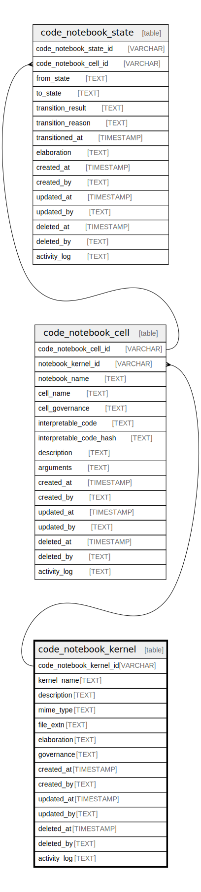

## Description

A Notebook is a group of Cells. A kernel is a computational engine that executes the code contained in a notebook cell.  Each notebook is associated with a kernel of a specific programming language or code transformer which can interpret  code and produce a result. For example, a SQL notebook might use a SQLite kernel for running SQL code and an AI Prompt  might prepare AI prompts for LLMs.

<details>
<summary><strong>Table Definition</strong></summary>

```sql
CREATE TABLE "code_notebook_kernel" (
    "code_notebook_kernel_id" VARCHAR PRIMARY KEY NOT NULL,
    "kernel_name" TEXT NOT NULL,
    "description" TEXT,
    "mime_type" TEXT,
    "file_extn" TEXT,
    "elaboration" TEXT CHECK(json_valid(elaboration) OR elaboration IS NULL),
    "governance" TEXT CHECK(json_valid(governance) OR governance IS NULL),
    "created_at" TIMESTAMP DEFAULT CURRENT_TIMESTAMP,
    "created_by" TEXT DEFAULT 'UNKNOWN',
    "updated_at" TIMESTAMP,
    "updated_by" TEXT,
    "deleted_at" TIMESTAMP,
    "deleted_by" TEXT,
    "activity_log" TEXT,
    UNIQUE("kernel_name")
)
```

</details>

## Columns

| Name                    | Type      | Default           | Nullable | Children                                    | Comment                                                                                            |
| ----------------------- | --------- | ----------------- | -------- | ------------------------------------------- | -------------------------------------------------------------------------------------------------- |
| code_notebook_kernel_id | VARCHAR   |                   | false    | [code_notebook_cell](/docs/standard-library/notebooks-schema/code_notebook_cell) | code_notebook_kernel primary key and internal label (not a ULID)                                   |
| kernel_name             | TEXT      |                   | false    |                                             | the kernel name for human/display use cases                                                        |
| description             | TEXT      |                   | true     |                                             | any further description of the kernel for human/display use cases                                  |
| mime_type               | TEXT      |                   | true     |                                             | MIME type of this kernel's code in case it will be served                                          |
| file_extn               | TEXT      |                   | true     |                                             | the typical file extension for these kernel's codebases, can be used for syntax highlighting, etc. |
| elaboration             | TEXT      |                   | true     |                                             | kernel-specific attributes/properties                                                              |
| governance              | TEXT      |                   | true     |                                             | kernel-specific governance data                                                                    |
| created_at              | TIMESTAMP | CURRENT_TIMESTAMP | true     |                                             |                                                                                                    |
| created_by              | TEXT      | 'UNKNOWN'         | true     |                                             |                                                                                                    |
| updated_at              | TIMESTAMP |                   | true     |                                             |                                                                                                    |
| updated_by              | TEXT      |                   | true     |                                             |                                                                                                    |
| deleted_at              | TIMESTAMP |                   | true     |                                             |                                                                                                    |
| deleted_by              | TEXT      |                   | true     |                                             |                                                                                                    |
| activity_log            | TEXT      |                   | true     |                                             | {"isSqlDomainZodDescrMeta":true,"isJsonSqlDomain":true}                                            |

## Constraints

| Name                                    | Type        | Definition                                            |
| --------------------------------------- | ----------- | ----------------------------------------------------- |
| code_notebook_kernel_id                 | PRIMARY KEY | PRIMARY KEY (code_notebook_kernel_id)                 |
| sqlite_autoindex_code_notebook_kernel_2 | UNIQUE      | UNIQUE (kernel_name)                                  |
| sqlite_autoindex_code_notebook_kernel_1 | PRIMARY KEY | PRIMARY KEY (code_notebook_kernel_id)                 |
| -                                       | CHECK       | CHECK(json_valid(elaboration) OR elaboration IS NULL) |
| -                                       | CHECK       | CHECK(json_valid(governance) OR governance IS NULL)   |

## Indexes

| Name                                    | Definition                            |
| --------------------------------------- | ------------------------------------- |
| sqlite_autoindex_code_notebook_kernel_2 | UNIQUE (kernel_name)                  |
| sqlite_autoindex_code_notebook_kernel_1 | PRIMARY KEY (code_notebook_kernel_id) |

## Relations


