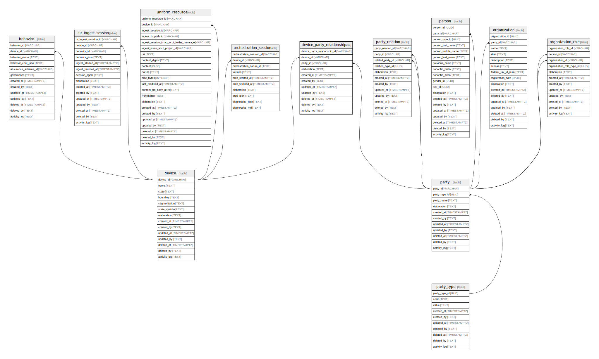

## Description

Entity to define relationships between multiple tenants to multiple devices

<details>
<summary><strong>Table Definition</strong></summary>

```sql
CREATE TABLE "device_party_relationship" (
    "device_party_relationship_id" VARCHAR PRIMARY KEY NOT NULL,
    "device_id" VARCHAR NOT NULL,
    "party_id" VARCHAR NOT NULL,
    "elaboration" TEXT CHECK(json_valid(elaboration) OR elaboration IS NULL),
    "created_at" TIMESTAMPTZ DEFAULT CURRENT_TIMESTAMP,
    "created_by" TEXT DEFAULT 'UNKNOWN',
    "updated_at" TIMESTAMPTZ,
    "updated_by" TEXT,
    "deleted_at" TIMESTAMPTZ,
    "deleted_by" TEXT,
    "activity_log" TEXT,
    FOREIGN KEY("device_id") REFERENCES "device"("device_id"),
    FOREIGN KEY("party_id") REFERENCES "party"("party_id"),
    UNIQUE("device_id", "party_id")
)
```

</details>

## Columns

| Name                         | Type        | Default           | Nullable | Parents                                                       | Comment                                                 |
| ---------------------------- | ----------- | ----------------- | -------- | ------------------------------------------------------------- | ------------------------------------------------------- |
| device_party_relationship_id | VARCHAR     |                   | false    |                                                               | {"isSqlDomainZodDescrMeta":true,"isVarChar":true}       |
| device_id                    | VARCHAR     |                   | false    | [device](/docs/standard-library/rssd-schema/device) | {"isSqlDomainZodDescrMeta":true,"isVarChar":true}       |
| party_id                     | VARCHAR     |                   | false    | [party](/docs/standard-library/rssd-schema/party)   | {"isSqlDomainZodDescrMeta":true,"isVarChar":true}       |
| elaboration                  | TEXT        |                   | true     |                                                               | {"isSqlDomainZodDescrMeta":true,"isJsonText":true}      |
| created_at                   | TIMESTAMPTZ | CURRENT_TIMESTAMP | true     |                                                               |                                                         |
| created_by                   | TEXT        | 'UNKNOWN'         | true     |                                                               |                                                         |
| updated_at                   | TIMESTAMPTZ |                   | true     |                                                               |                                                         |
| updated_by                   | TEXT        |                   | true     |                                                               |                                                         |
| deleted_at                   | TIMESTAMPTZ |                   | true     |                                                               |                                                         |
| deleted_by                   | TEXT        |                   | true     |                                                               |                                                         |
| activity_log                 | TEXT        |                   | true     |                                                               | {"isSqlDomainZodDescrMeta":true,"isJsonSqlDomain":true} |

## Constraints

| Name                                         | Type        | Definition                                                                                               |
| -------------------------------------------- | ----------- | -------------------------------------------------------------------------------------------------------- |
| device_party_relationship_id                 | PRIMARY KEY | PRIMARY KEY (device_party_relationship_id)                                                               |
| - (Foreign key ID: 0)                        | FOREIGN KEY | FOREIGN KEY (party_id) REFERENCES party (party_id) ON UPDATE NO ACTION ON DELETE NO ACTION MATCH NONE    |
| - (Foreign key ID: 1)                        | FOREIGN KEY | FOREIGN KEY (device_id) REFERENCES device (device_id) ON UPDATE NO ACTION ON DELETE NO ACTION MATCH NONE |
| sqlite_autoindex_device_party_relationship_2 | UNIQUE      | UNIQUE (device_id, party_id)                                                                             |
| sqlite_autoindex_device_party_relationship_1 | PRIMARY KEY | PRIMARY KEY (device_party_relationship_id)                                                               |
| -                                            | CHECK       | CHECK(json_valid(elaboration) OR elaboration IS NULL)                                                    |

## Indexes

| Name                                               | Definition                                                                                                                |
| -------------------------------------------------- | ------------------------------------------------------------------------------------------------------------------------- |
| idx_device_party_relationship__device_id__party_id | CREATE INDEX "idx_device_party_relationship__device_id__party_id" ON "device_party_relationship"("device_id", "party_id") |
| sqlite_autoindex_device_party_relationship_2       | UNIQUE (device_id, party_id)                                                                                              |
| sqlite_autoindex_device_party_relationship_1       | PRIMARY KEY (device_party_relationship_id)                                                                                |

## Relations


