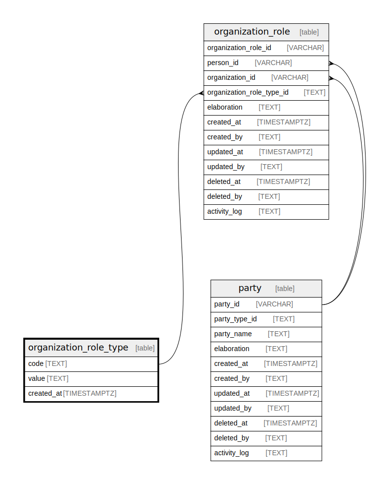

## Description

<details>
<summary><strong>Table Definition</strong></summary>

```sql
CREATE TABLE "organization_role_type" (
    "code" TEXT PRIMARY KEY NOT NULL,
    "value" TEXT NOT NULL,
    "created_at" TIMESTAMPTZ DEFAULT CURRENT_TIMESTAMP
)
```

</details>

## Columns

| Name       | Type        | Default           | Nullable | Children                                                                            | Comment |
| ---------- | ----------- | ----------------- | -------- | ----------------------------------------------------------------------------------- | ------- |
| code       | TEXT        |                   | false    | [organization_role](/docs/standard-library/rssd-schema/organization_role) |         |
| value      | TEXT        |                   | false    |                                                                                     |         |
| created_at | TIMESTAMPTZ | CURRENT_TIMESTAMP | true     |                                                                                     |         |

## Constraints

| Name                                      | Type        | Definition         |
| ----------------------------------------- | ----------- | ------------------ |
| code                                      | PRIMARY KEY | PRIMARY KEY (code) |
| sqlite_autoindex_organization_role_type_1 | PRIMARY KEY | PRIMARY KEY (code) |

## Indexes

| Name                                      | Definition         |
| ----------------------------------------- | ------------------ |
| sqlite_autoindex_organization_role_type_1 | PRIMARY KEY (code) |

## Relations


