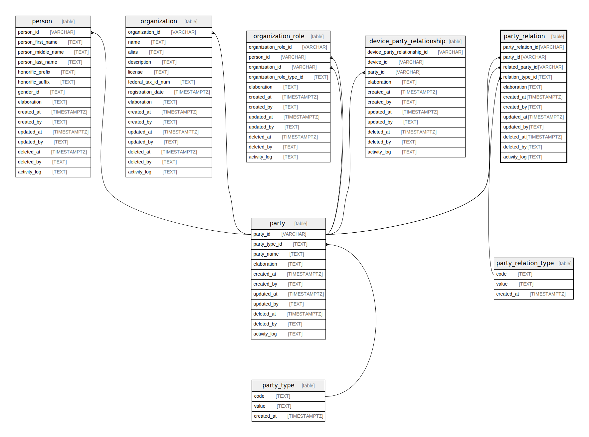

## Description

Entity to define relationships between parties. Each party relation has a unique
ID associated with it.

<details>
<summary><strong>Table Definition</strong></summary>

```sql
CREATE TABLE "party_relation" (
    "party_relation_id" VARCHAR PRIMARY KEY NOT NULL,
    "party_id" VARCHAR NOT NULL,
    "related_party_id" VARCHAR NOT NULL,
    "relation_type_id" TEXT NOT NULL,
    "elaboration" TEXT CHECK(json_valid(elaboration) OR elaboration IS NULL),
    "created_at" TIMESTAMPTZ DEFAULT CURRENT_TIMESTAMP,
    "created_by" TEXT DEFAULT 'UNKNOWN',
    "updated_at" TIMESTAMPTZ,
    "updated_by" TEXT,
    "deleted_at" TIMESTAMPTZ,
    "deleted_by" TEXT,
    "activity_log" TEXT,
    FOREIGN KEY("party_id") REFERENCES "party"("party_id"),
    FOREIGN KEY("related_party_id") REFERENCES "party"("party_id"),
    FOREIGN KEY("relation_type_id") REFERENCES "party_relation_type"("code"),
    UNIQUE("party_id", "related_party_id", "relation_type_id")
)
```

</details>

## Columns

| Name              | Type        | Default           | Nullable | Parents                                                                                 | Comment                                                 |
| ----------------- | ----------- | ----------------- | -------- | --------------------------------------------------------------------------------------- | ------------------------------------------------------- |
| party_relation_id | VARCHAR     |                   | false    |                                                                                         | {"isSqlDomainZodDescrMeta":true,"isVarChar":true}       |
| party_id          | VARCHAR     |                   | false    | [party](/docs/standard-library/rssd-schema/party)                             | {"isSqlDomainZodDescrMeta":true,"isVarChar":true}       |
| related_party_id  | VARCHAR     |                   | false    | [party](/docs/standard-library/rssd-schema/party)                             | {"isSqlDomainZodDescrMeta":true,"isVarChar":true}       |
| relation_type_id  | TEXT        |                   | false    | [party_relation_type](/docs/standard-library/rssd-schema/party_relation_type) |                                                         |
| elaboration       | TEXT        |                   | true     |                                                                                         | {"isSqlDomainZodDescrMeta":true,"isJsonText":true}      |
| created_at        | TIMESTAMPTZ | CURRENT_TIMESTAMP | true     |                                                                                         |                                                         |
| created_by        | TEXT        | 'UNKNOWN'         | true     |                                                                                         |                                                         |
| updated_at        | TIMESTAMPTZ |                   | true     |                                                                                         |                                                         |
| updated_by        | TEXT        |                   | true     |                                                                                         |                                                         |
| deleted_at        | TIMESTAMPTZ |                   | true     |                                                                                         |                                                         |
| deleted_by        | TEXT        |                   | true     |                                                                                         |                                                         |
| activity_log      | TEXT        |                   | true     |                                                                                         | {"isSqlDomainZodDescrMeta":true,"isJsonSqlDomain":true} |

## Constraints

| Name                              | Type        | Definition                                                                                                              |
| --------------------------------- | ----------- | ----------------------------------------------------------------------------------------------------------------------- |
| party_relation_id                 | PRIMARY KEY | PRIMARY KEY (party_relation_id)                                                                                         |
| - (Foreign key ID: 0)             | FOREIGN KEY | FOREIGN KEY (relation_type_id) REFERENCES party_relation_type (code) ON UPDATE NO ACTION ON DELETE NO ACTION MATCH NONE |
| - (Foreign key ID: 1)             | FOREIGN KEY | FOREIGN KEY (related_party_id) REFERENCES party (party_id) ON UPDATE NO ACTION ON DELETE NO ACTION MATCH NONE           |
| - (Foreign key ID: 2)             | FOREIGN KEY | FOREIGN KEY (party_id) REFERENCES party (party_id) ON UPDATE NO ACTION ON DELETE NO ACTION MATCH NONE                   |
| sqlite_autoindex_party_relation_2 | UNIQUE      | UNIQUE (party_id, related_party_id, relation_type_id)                                                                   |
| sqlite_autoindex_party_relation_1 | PRIMARY KEY | PRIMARY KEY (party_relation_id)                                                                                         |
| -                                 | CHECK       | CHECK(json_valid(elaboration) OR elaboration IS NULL)                                                                   |

## Indexes

| Name                                                             | Definition                                                                                                                                              |
| ---------------------------------------------------------------- | ------------------------------------------------------------------------------------------------------------------------------------------------------- |
| idx_party_relation__party_id__related_party_id__relation_type_id | CREATE INDEX "idx_party_relation__party_id__related_party_id__relation_type_id" ON "party_relation"("party_id", "related_party_id", "relation_type_id") |
| sqlite_autoindex_party_relation_2                                | UNIQUE (party_id, related_party_id, relation_type_id)                                                                                                   |
| sqlite_autoindex_party_relation_1                                | PRIMARY KEY (party_relation_id)                                                                                                                         |

## Relations


