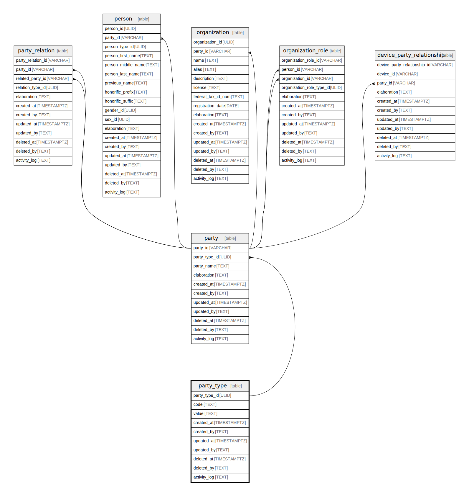

## Description

<details>
<summary><strong>Table Definition</strong></summary>

```sql
CREATE TABLE "party_type" (
    "party_type_id" ULID PRIMARY KEY NOT NULL,
    "code" TEXT /* UNIQUE COLUMN */ NOT NULL,
    "value" TEXT NOT NULL,
    "created_at" TIMESTAMPTZ DEFAULT CURRENT_TIMESTAMP,
    "created_by" TEXT DEFAULT 'UNKNOWN',
    "updated_at" TIMESTAMPTZ,
    "updated_by" TEXT,
    "deleted_at" TIMESTAMPTZ,
    "deleted_by" TEXT,
    "activity_log" TEXT,
    UNIQUE("code")
)
```

</details>

## Columns

| Name          | Type        | Default           | Nullable | Children          | Comment                                                 |
| ------------- | ----------- | ----------------- | -------- | ----------------- | ------------------------------------------------------- |
| party_type_id | ULID        |                   | false    | [party](/docs/standard-library/rssd-schema/party) | {"isSqlDomainZodDescrMeta":true,"isUlid":true}          |
| code          | TEXT        |                   | false    |                   |                                                         |
| value         | TEXT        |                   | false    |                   |                                                         |
| created_at    | TIMESTAMPTZ | CURRENT_TIMESTAMP | true     |                   |                                                         |
| created_by    | TEXT        | 'UNKNOWN'         | true     |                   |                                                         |
| updated_at    | TIMESTAMPTZ |                   | true     |                   |                                                         |
| updated_by    | TEXT        |                   | true     |                   |                                                         |
| deleted_at    | TIMESTAMPTZ |                   | true     |                   |                                                         |
| deleted_by    | TEXT        |                   | true     |                   |                                                         |
| activity_log  | TEXT        |                   | true     |                   | {"isSqlDomainZodDescrMeta":true,"isJsonSqlDomain":true} |

## Constraints

| Name                          | Type        | Definition                  |
| ----------------------------- | ----------- | --------------------------- |
| party_type_id                 | PRIMARY KEY | PRIMARY KEY (party_type_id) |
| sqlite_autoindex_party_type_2 | UNIQUE      | UNIQUE (code)               |
| sqlite_autoindex_party_type_1 | PRIMARY KEY | PRIMARY KEY (party_type_id) |

## Indexes

| Name                          | Definition                  |
| ----------------------------- | --------------------------- |
| sqlite_autoindex_party_type_2 | UNIQUE (code)               |
| sqlite_autoindex_party_type_1 | PRIMARY KEY (party_type_id) |

## Relations


