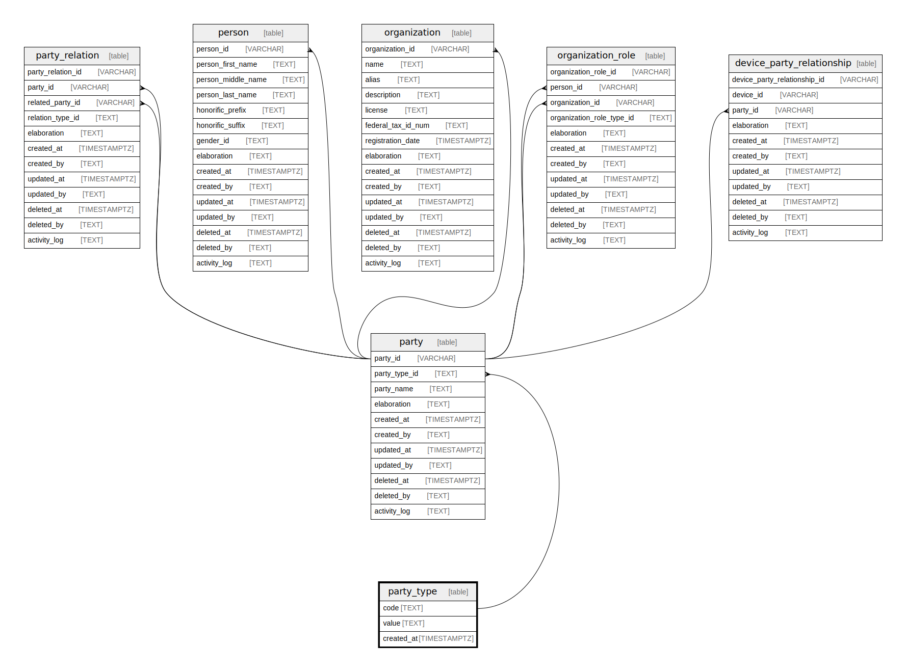

## Description

<details>
<summary><strong>Table Definition</strong></summary>

```sql
CREATE TABLE "party_type" (
    "code" TEXT PRIMARY KEY NOT NULL,
    "value" TEXT NOT NULL,
    "created_at" TIMESTAMPTZ DEFAULT CURRENT_TIMESTAMP
)
```

</details>

## Columns

| Name       | Type        | Default           | Nullable | Children                                                    | Comment |
| ---------- | ----------- | ----------------- | -------- | ----------------------------------------------------------- | ------- |
| code       | TEXT        |                   | false    | [party](/docs/standard-library/rssd-schema/party) |         |
| value      | TEXT        |                   | false    |                                                             |         |
| created_at | TIMESTAMPTZ | CURRENT_TIMESTAMP | true     |                                                             |         |

## Constraints

| Name                          | Type        | Definition         |
| ----------------------------- | ----------- | ------------------ |
| code                          | PRIMARY KEY | PRIMARY KEY (code) |
| sqlite_autoindex_party_type_1 | PRIMARY KEY | PRIMARY KEY (code) |

## Indexes

| Name                          | Definition         |
| ----------------------------- | ------------------ |
| sqlite_autoindex_party_type_1 | PRIMARY KEY (code) |

## Relations


