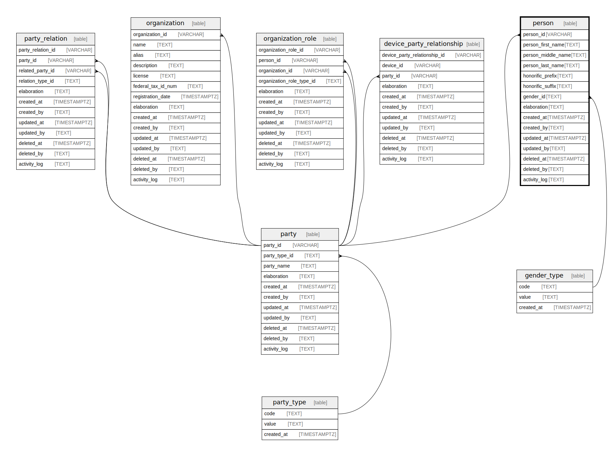

## Description

Entity to store information about individuals as persons. Each person has a unique ID associated with them.

<details>
<summary><strong>Table Definition</strong></summary>

```sql
CREATE TABLE "person" (
    "person_id" ULID PRIMARY KEY NOT NULL,
    "party_id" VARCHAR NOT NULL,
    "person_type_id" ULID NOT NULL,
    "person_first_name" TEXT NOT NULL,
    "person_middle_name" TEXT,
    "person_last_name" TEXT NOT NULL,
    "previous_name" TEXT,
    "honorific_prefix" TEXT,
    "honorific_suffix" TEXT,
    "gender_id" ULID NOT NULL,
    "sex_id" ULID NOT NULL,
    "elaboration" TEXT CHECK(json_valid(elaboration) OR elaboration IS NULL),
    "created_at" TIMESTAMPTZ DEFAULT CURRENT_TIMESTAMP,
    "created_by" TEXT DEFAULT 'UNKNOWN',
    "updated_at" TIMESTAMPTZ,
    "updated_by" TEXT,
    "deleted_at" TIMESTAMPTZ,
    "deleted_by" TEXT,
    "activity_log" TEXT,
    FOREIGN KEY("party_id") REFERENCES "party"("party_id"),
    FOREIGN KEY("person_type_id") REFERENCES "person_type"("person_type_id"),
    FOREIGN KEY("gender_id") REFERENCES "gender_type"("gender_type_id"),
    FOREIGN KEY("sex_id") REFERENCES "sex_type"("sex_type_id")
)
```

</details>

## Columns

| Name               | Type        | Default           | Nullable | Parents                       | Comment                                                 |
| ------------------ | ----------- | ----------------- | -------- | ----------------------------- | ------------------------------------------------------- |
| person_id          | ULID        |                   | false    |                               | {"isSqlDomainZodDescrMeta":true,"isUlid":true}          |
| party_id           | VARCHAR     |                   | false    | [party](/docs/standard-library/rssd-schema/party)             | {"isSqlDomainZodDescrMeta":true,"isVarChar":true}       |
| person_type_id     | ULID        |                   | false    | [person_type](/docs/standard-library/rssd-schema/person_type) | {"isSqlDomainZodDescrMeta":true,"isUlid":true}          |
| person_first_name  | TEXT        |                   | false    |                               |                                                         |
| person_middle_name | TEXT        |                   | true     |                               |                                                         |
| person_last_name   | TEXT        |                   | false    |                               |                                                         |
| previous_name      | TEXT        |                   | true     |                               |                                                         |
| honorific_prefix   | TEXT        |                   | true     |                               |                                                         |
| honorific_suffix   | TEXT        |                   | true     |                               |                                                         |
| gender_id          | ULID        |                   | false    | [gender_type](/docs/standard-library/rssd-schema/gender_type) | {"isSqlDomainZodDescrMeta":true,"isUlid":true}          |
| sex_id             | ULID        |                   | false    | [sex_type](/docs/standard-library/rssd-schema/sex_type)       | {"isSqlDomainZodDescrMeta":true,"isUlid":true}          |
| elaboration        | TEXT        |                   | true     |                               | {"isSqlDomainZodDescrMeta":true,"isJsonText":true}      |
| created_at         | TIMESTAMPTZ | CURRENT_TIMESTAMP | true     |                               |                                                         |
| created_by         | TEXT        | 'UNKNOWN'         | true     |                               |                                                         |
| updated_at         | TIMESTAMPTZ |                   | true     |                               |                                                         |
| updated_by         | TEXT        |                   | true     |                               |                                                         |
| deleted_at         | TIMESTAMPTZ |                   | true     |                               |                                                         |
| deleted_by         | TEXT        |                   | true     |                               |                                                         |
| activity_log       | TEXT        |                   | true     |                               | {"isSqlDomainZodDescrMeta":true,"isJsonSqlDomain":true} |

## Constraints

| Name                      | Type        | Definition                                                                                                              |
| ------------------------- | ----------- | ----------------------------------------------------------------------------------------------------------------------- |
| person_id                 | PRIMARY KEY | PRIMARY KEY (person_id)                                                                                                 |
| - (Foreign key ID: 0)     | FOREIGN KEY | FOREIGN KEY (sex_id) REFERENCES sex_type (sex_type_id) ON UPDATE NO ACTION ON DELETE NO ACTION MATCH NONE               |
| - (Foreign key ID: 1)     | FOREIGN KEY | FOREIGN KEY (gender_id) REFERENCES gender_type (gender_type_id) ON UPDATE NO ACTION ON DELETE NO ACTION MATCH NONE      |
| - (Foreign key ID: 2)     | FOREIGN KEY | FOREIGN KEY (person_type_id) REFERENCES person_type (person_type_id) ON UPDATE NO ACTION ON DELETE NO ACTION MATCH NONE |
| - (Foreign key ID: 3)     | FOREIGN KEY | FOREIGN KEY (party_id) REFERENCES party (party_id) ON UPDATE NO ACTION ON DELETE NO ACTION MATCH NONE                   |
| sqlite_autoindex_person_1 | PRIMARY KEY | PRIMARY KEY (person_id)                                                                                                 |
| -                         | CHECK       | CHECK(json_valid(elaboration) OR elaboration IS NULL)                                                                   |

## Indexes

| Name                      | Definition              |
| ------------------------- | ----------------------- |
| sqlite_autoindex_person_1 | PRIMARY KEY (person_id) |

## Relations


