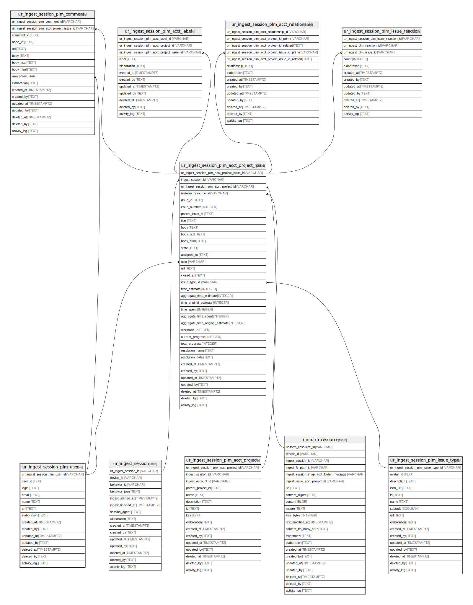

## Description

<details>
<summary><strong>Table Definition</strong></summary>

```sql
CREATE TABLE "ur_ingest_session_plm_user" (
    "ur_ingest_session_plm_user_id" VARCHAR PRIMARY KEY NOT NULL,
    "user_id" TEXT NOT NULL,
    "login" TEXT NOT NULL,
    "email" TEXT,
    "name" TEXT,
    "url" TEXT NOT NULL,
    "elaboration" TEXT CHECK(json_valid(elaboration) OR elaboration IS NULL),
    "created_at" TIMESTAMPTZ DEFAULT CURRENT_TIMESTAMP,
    "created_by" TEXT DEFAULT 'UNKNOWN',
    "updated_at" TIMESTAMPTZ,
    "updated_by" TEXT,
    "deleted_at" TIMESTAMPTZ,
    "deleted_by" TEXT,
    "activity_log" TEXT,
    UNIQUE("user_id", "login", "email", "name")
)
```

</details>

## Columns

| Name                          | Type        | Default           | Nullable | Children                                                                                                                                                                                                                                      | Comment                                                 |
| ----------------------------- | ----------- | ----------------- | -------- | --------------------------------------------------------------------------------------------------------------------------------------------------------------------------------------------------------------------------------------------- | ------------------------------------------------------- |
| ur_ingest_session_plm_user_id | VARCHAR     |                   | false    | [ur_ingest_session_plm_acct_project_issue](/docs/standard-library/rssd-schema/ur_ingest_session_plm_acct_project_issue) [ur_ingest_session_plm_comment](/docs/standard-library/rssd-schema/ur_ingest_session_plm_comment) | {"isSqlDomainZodDescrMeta":true,"isVarChar":true}       |
| user_id                       | TEXT        |                   | false    |                                                                                                                                                                                                                                               |                                                         |
| login                         | TEXT        |                   | false    |                                                                                                                                                                                                                                               |                                                         |
| email                         | TEXT        |                   | true     |                                                                                                                                                                                                                                               |                                                         |
| name                          | TEXT        |                   | true     |                                                                                                                                                                                                                                               |                                                         |
| url                           | TEXT        |                   | false    |                                                                                                                                                                                                                                               |                                                         |
| elaboration                   | TEXT        |                   | true     |                                                                                                                                                                                                                                               | {"isSqlDomainZodDescrMeta":true,"isJsonText":true}      |
| created_at                    | TIMESTAMPTZ | CURRENT_TIMESTAMP | true     |                                                                                                                                                                                                                                               |                                                         |
| created_by                    | TEXT        | 'UNKNOWN'         | true     |                                                                                                                                                                                                                                               |                                                         |
| updated_at                    | TIMESTAMPTZ |                   | true     |                                                                                                                                                                                                                                               |                                                         |
| updated_by                    | TEXT        |                   | true     |                                                                                                                                                                                                                                               |                                                         |
| deleted_at                    | TIMESTAMPTZ |                   | true     |                                                                                                                                                                                                                                               |                                                         |
| deleted_by                    | TEXT        |                   | true     |                                                                                                                                                                                                                                               |                                                         |
| activity_log                  | TEXT        |                   | true     |                                                                                                                                                                                                                                               | {"isSqlDomainZodDescrMeta":true,"isJsonSqlDomain":true} |

## Constraints

| Name                                          | Type        | Definition                                            |
| --------------------------------------------- | ----------- | ----------------------------------------------------- |
| ur_ingest_session_plm_user_id                 | PRIMARY KEY | PRIMARY KEY (ur_ingest_session_plm_user_id)           |
| sqlite_autoindex_ur_ingest_session_plm_user_2 | UNIQUE      | UNIQUE (user_id, login, email, name)                  |
| sqlite_autoindex_ur_ingest_session_plm_user_1 | PRIMARY KEY | PRIMARY KEY (ur_ingest_session_plm_user_id)           |
| -                                             | CHECK       | CHECK(json_valid(elaboration) OR elaboration IS NULL) |

## Indexes

| Name                                          | Definition                                                                                        |
| --------------------------------------------- | ------------------------------------------------------------------------------------------------- |
| idx_ur_ingest_session_plm_user__user_id       | CREATE INDEX "idx_ur_ingest_session_plm_user__user_id" ON "ur_ingest_session_plm_user"("user_id") |
| sqlite_autoindex_ur_ingest_session_plm_user_2 | UNIQUE (user_id, login, email, name)                                                              |
| sqlite_autoindex_ur_ingest_session_plm_user_1 | PRIMARY KEY (ur_ingest_session_plm_user_id)                                                       |

## Relations


