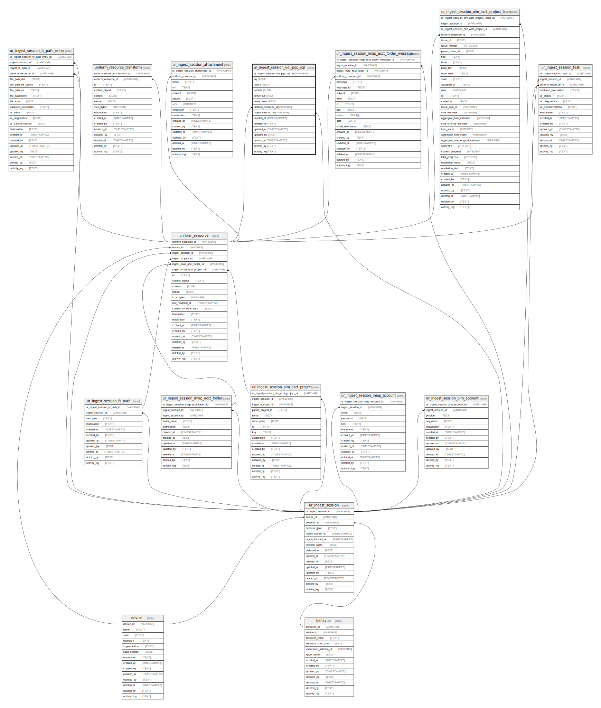

## Description

UDI PGP stored response

<details>
<summary><strong>Table Definition</strong></summary>

```sql
CREATE TABLE "ur_ingest_session_udi_pgp_sql" (
    "ur_ingest_session_udi_pgp_sql_id" VARCHAR PRIMARY KEY NOT NULL,
    "sql" TEXT NOT NULL,
    "nature" TEXT NOT NULL,
    "content" BLOB,
    "behaviour" TEXT CHECK(json_valid(behaviour) OR behaviour IS NULL),
    "query_error" TEXT,
    "uniform_resource_id" VARCHAR,
    "ingest_session_id" VARCHAR,
    "created_at" TIMESTAMPTZ DEFAULT CURRENT_TIMESTAMP,
    "created_by" TEXT DEFAULT 'UNKNOWN',
    "updated_at" TIMESTAMPTZ,
    "updated_by" TEXT,
    "deleted_at" TIMESTAMPTZ,
    "deleted_by" TEXT,
    "activity_log" TEXT,
    FOREIGN KEY("uniform_resource_id") REFERENCES "uniform_resource"("uniform_resource_id"),
    FOREIGN KEY("ingest_session_id") REFERENCES "ur_ingest_session"("ur_ingest_session_id"),
    UNIQUE("sql", "ingest_session_id")
)
```

</details>

## Columns

| Name                             | Type        | Default           | Nullable | Parents                                                                             | Comment                                                 |
| -------------------------------- | ----------- | ----------------- | -------- | ----------------------------------------------------------------------------------- | ------------------------------------------------------- |
| ur_ingest_session_udi_pgp_sql_id | VARCHAR     |                   | false    |                                                                                     | ur_ingest_session_udi_pgp_sql ULID primary key          |
| sql                              | TEXT        |                   | false    |                                                                                     | full query for the response                             |
| nature                           | TEXT        |                   | false    |                                                                                     | type of sql. DDL, DQL or DML                            |
| content                          | BLOB        |                   | true     |                                                                                     | raw response                                            |
| behaviour                        | TEXT        |                   | true     |                                                                                     | the query configuration passed in the comment           |
| query_error                      | TEXT        |                   | true     |                                                                                     |                                                         |
| uniform_resource_id              | VARCHAR     |                   | true     | [uniform_resource](/docs/standard-library/rssd-schema/uniform_resource)   | uniform_resource row ID of original content             |
| ingest_session_id                | VARCHAR     |                   | true     | [ur_ingest_session](/docs/standard-library/rssd-schema/ur_ingest_session) | {"isSqlDomainZodDescrMeta":true,"isVarChar":true}       |
| created_at                       | TIMESTAMPTZ | CURRENT_TIMESTAMP | true     |                                                                                     |                                                         |
| created_by                       | TEXT        | 'UNKNOWN'         | true     |                                                                                     |                                                         |
| updated_at                       | TIMESTAMPTZ |                   | true     |                                                                                     |                                                         |
| updated_by                       | TEXT        |                   | true     |                                                                                     |                                                         |
| deleted_at                       | TIMESTAMPTZ |                   | true     |                                                                                     |                                                         |
| deleted_by                       | TEXT        |                   | true     |                                                                                     |                                                         |
| activity_log                     | TEXT        |                   | true     |                                                                                     | {"isSqlDomainZodDescrMeta":true,"isJsonSqlDomain":true} |

## Constraints

| Name                                             | Type        | Definition                                                                                                                             |
| ------------------------------------------------ | ----------- | -------------------------------------------------------------------------------------------------------------------------------------- |
| ur_ingest_session_udi_pgp_sql_id                 | PRIMARY KEY | PRIMARY KEY (ur_ingest_session_udi_pgp_sql_id)                                                                                         |
| - (Foreign key ID: 0)                            | FOREIGN KEY | FOREIGN KEY (ingest_session_id) REFERENCES ur_ingest_session (ur_ingest_session_id) ON UPDATE NO ACTION ON DELETE NO ACTION MATCH NONE |
| - (Foreign key ID: 1)                            | FOREIGN KEY | FOREIGN KEY (uniform_resource_id) REFERENCES uniform_resource (uniform_resource_id) ON UPDATE NO ACTION ON DELETE NO ACTION MATCH NONE |
| sqlite_autoindex_ur_ingest_session_udi_pgp_sql_2 | UNIQUE      | UNIQUE (sql, ingest_session_id)                                                                                                        |
| sqlite_autoindex_ur_ingest_session_udi_pgp_sql_1 | PRIMARY KEY | PRIMARY KEY (ur_ingest_session_udi_pgp_sql_id)                                                                                         |
| -                                                | CHECK       | CHECK(json_valid(behaviour) OR behaviour IS NULL)                                                                                      |

## Indexes

| Name                                                 | Definition                                                                                                                  |
| ---------------------------------------------------- | --------------------------------------------------------------------------------------------------------------------------- |
| idx_ur_ingest_session_udi_pgp_sql__ingest_session_id | CREATE INDEX "idx_ur_ingest_session_udi_pgp_sql__ingest_session_id" ON "ur_ingest_session_udi_pgp_sql"("ingest_session_id") |
| sqlite_autoindex_ur_ingest_session_udi_pgp_sql_2     | UNIQUE (sql, ingest_session_id)                                                                                             |
| sqlite_autoindex_ur_ingest_session_udi_pgp_sql_1     | PRIMARY KEY (ur_ingest_session_udi_pgp_sql_id)                                                                              |

## Relations


