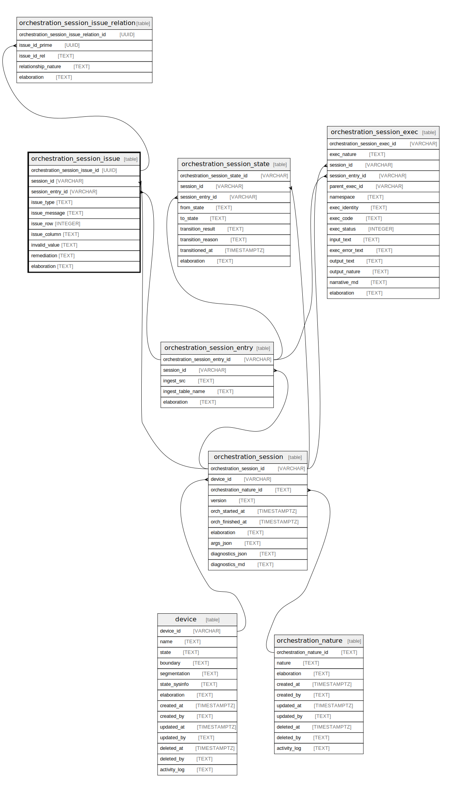

## Description

An orchestration issue is generated when an error or warning needs to\
be created during the orchestration of an entry in a session.

<details>
<summary><strong>Table Definition</strong></summary>

```sql
CREATE TABLE "orchestration_session_issue" (
    "orchestration_session_issue_id" UUID PRIMARY KEY NOT NULL,
    "session_id" VARCHAR NOT NULL,
    "session_entry_id" VARCHAR,
    "issue_type" TEXT NOT NULL,
    "issue_message" TEXT NOT NULL,
    "issue_row" INTEGER,
    "issue_column" TEXT,
    "invalid_value" TEXT,
    "remediation" TEXT,
    "elaboration" TEXT CHECK(json_valid(elaboration) OR elaboration IS NULL),
    FOREIGN KEY("session_id") REFERENCES "orchestration_session"("orchestration_session_id"),
    FOREIGN KEY("session_entry_id") REFERENCES "orchestration_session_entry"("orchestration_session_entry_id")
)
```

</details>

## Columns

| Name                           | Type    | Default | Nullable | Children                                                                                                                  | Parents                                                                                                 | Comment                                                                            |
| ------------------------------ | ------- | ------- | -------- | ------------------------------------------------------------------------------------------------------------------------- | ------------------------------------------------------------------------------------------------------- | ---------------------------------------------------------------------------------- |
| orchestration_session_issue_id | UUID    |         | false    | [orchestration_session_issue_relation](/docs/standard-library/rssd-schema/orchestration_session_issue_relation) |                                                                                                         | orchestration_session_issue primary key and internal label (UUID)                  |
| session_id                     | VARCHAR |         | false    |                                                                                                                           | [orchestration_session](/docs/standard-library/rssd-schema/orchestration_session)             | {"isSqlDomainZodDescrMeta":true,"isVarChar":true}                                  |
| session_entry_id               | VARCHAR |         | true     |                                                                                                                           | [orchestration_session_entry](/docs/standard-library/rssd-schema/orchestration_session_entry) | {"isSqlDomainZodDescrMeta":true,"isVarChar":true}                                  |
| issue_type                     | TEXT    |         | false    |                                                                                                                           |                                                                                                         | The category of an issue                                                           |
| issue_message                  | TEXT    |         | false    |                                                                                                                           |                                                                                                         | The human-friendly message for an issue                                            |
| issue_row                      | INTEGER |         | true     |                                                                                                                           |                                                                                                         | The row number in which the issue occurred (may be NULL if not applicable)         |
| issue_column                   | TEXT    |         | true     |                                                                                                                           |                                                                                                         | The name of the column in which the issue occurred (may be NULL if not applicable) |
| invalid_value                  | TEXT    |         | true     |                                                                                                                           |                                                                                                         | The invalid value which caused the issue (may be NULL if not applicable)           |
| remediation                    | TEXT    |         | true     |                                                                                                                           |                                                                                                         | If the issue is correctable, explain how to correct it.                            |
| elaboration                    | TEXT    |         | true     |                                                                                                                           |                                                                                                         | isse-specific attributes/properties in JSON ("custom data")                        |

## Constraints

| Name                                           | Type        | Definition                                                                                                                                                |
| ---------------------------------------------- | ----------- | --------------------------------------------------------------------------------------------------------------------------------------------------------- |
| orchestration_session_issue_id                 | PRIMARY KEY | PRIMARY KEY (orchestration_session_issue_id)                                                                                                              |
| - (Foreign key ID: 0)                          | FOREIGN KEY | FOREIGN KEY (session_entry_id) REFERENCES orchestration_session_entry (orchestration_session_entry_id) ON UPDATE NO ACTION ON DELETE NO ACTION MATCH NONE |
| - (Foreign key ID: 1)                          | FOREIGN KEY | FOREIGN KEY (session_id) REFERENCES orchestration_session (orchestration_session_id) ON UPDATE NO ACTION ON DELETE NO ACTION MATCH NONE                   |
| sqlite_autoindex_orchestration_session_issue_1 | PRIMARY KEY | PRIMARY KEY (orchestration_session_issue_id)                                                                                                              |
| -                                              | CHECK       | CHECK(json_valid(elaboration) OR elaboration IS NULL)                                                                                                     |

## Indexes

| Name                                           | Definition                                   |
| ---------------------------------------------- | -------------------------------------------- |
| sqlite_autoindex_orchestration_session_issue_1 | PRIMARY KEY (orchestration_session_issue_id) |

## Relations


