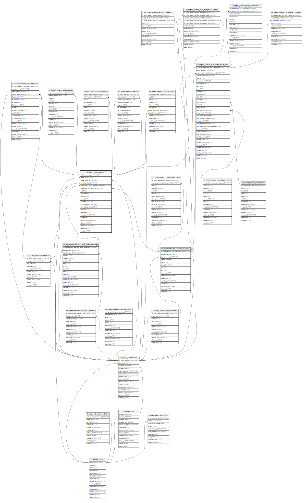

## Description

Immutable resource and content information. On multiple executions,\
uniform_resource are inserted only if the the content (see unique\
index for details). For historical logging, uniform_resource has foreign\
key references to both ur_ingest_session and ur_ingest_session_fs_path\
tables to indicate which particular session and ingestion path the\
resourced was inserted during.

<details>
<summary><strong>Table Definition</strong></summary>

```sql
CREATE TABLE "uniform_resource" (
    "uniform_resource_id" VARCHAR PRIMARY KEY NOT NULL,
    "device_id" VARCHAR NOT NULL,
    "ingest_session_id" VARCHAR NOT NULL,
    "ingest_fs_path_id" VARCHAR,
    "ingest_imap_acct_folder_id" VARCHAR,
    "ingest_issue_acct_project_id" VARCHAR,
    "uri" TEXT NOT NULL,
    "content_digest" TEXT NOT NULL,
    "content" BLOB,
    "nature" TEXT,
    "size_bytes" INTEGER,
    "last_modified_at" TIMESTAMPTZ,
    "content_fm_body_attrs" TEXT CHECK(json_valid(content_fm_body_attrs) OR content_fm_body_attrs IS NULL),
    "frontmatter" TEXT CHECK(json_valid(frontmatter) OR frontmatter IS NULL),
    "elaboration" TEXT CHECK(json_valid(elaboration) OR elaboration IS NULL),
    "created_at" TIMESTAMPTZ DEFAULT CURRENT_TIMESTAMP,
    "created_by" TEXT DEFAULT 'UNKNOWN',
    "updated_at" TIMESTAMPTZ,
    "updated_by" TEXT,
    "deleted_at" TIMESTAMPTZ,
    "deleted_by" TEXT,
    "activity_log" TEXT,
    FOREIGN KEY("device_id") REFERENCES "device"("device_id"),
    FOREIGN KEY("ingest_session_id") REFERENCES "ur_ingest_session"("ur_ingest_session_id"),
    FOREIGN KEY("ingest_fs_path_id") REFERENCES "ur_ingest_session_fs_path"("ur_ingest_session_fs_path_id"),
    FOREIGN KEY("ingest_imap_acct_folder_id") REFERENCES "ur_ingest_session_imap_acct_folder"("ur_ingest_session_imap_acct_folder_id"),
    FOREIGN KEY("ingest_issue_acct_project_id") REFERENCES "ur_ingest_session_plm_acct_project"("ur_ingest_session_plm_acct_project_id"),
    UNIQUE("device_id", "content_digest", "uri", "size_bytes", "last_modified_at")
)
```

</details>

## Columns

| Name                         | Type        | Default           | Nullable | Children                                                                                                                                                                                                                                                                                                                                                                                                                                                                                                                                                                                                                                                                                                                                                                                                          | Parents                                                                                                               | Comment                                                                                                |
| ---------------------------- | ----------- | ----------------- | -------- | ----------------------------------------------------------------------------------------------------------------------------------------------------------------------------------------------------------------------------------------------------------------------------------------------------------------------------------------------------------------------------------------------------------------------------------------------------------------------------------------------------------------------------------------------------------------------------------------------------------------------------------------------------------------------------------------------------------------------------------------------------------------------------------------------------------------- | --------------------------------------------------------------------------------------------------------------------- | ------------------------------------------------------------------------------------------------------ |
| uniform_resource_id          | VARCHAR     |                   | false    | [uniform_resource_transform](/docs/standard-library/rssd-schema/uniform_resource_transform) [ur_ingest_session_fs_path_entry](/docs/standard-library/rssd-schema/ur_ingest_session_fs_path_entry) [ur_ingest_session_task](/docs/standard-library/rssd-schema/ur_ingest_session_task) [ur_ingest_session_imap_acct_folder_message](/docs/standard-library/rssd-schema/ur_ingest_session_imap_acct_folder_message) [ur_ingest_session_plm_acct_project_issue](/docs/standard-library/rssd-schema/ur_ingest_session_plm_acct_project_issue) [ur_ingest_session_attachment](/docs/standard-library/rssd-schema/ur_ingest_session_attachment) [ur_ingest_session_udi_pgp_sql](/docs/standard-library/rssd-schema/ur_ingest_session_udi_pgp_sql) |                                                                                                                       | uniform_resource ULID primary key                                                                      |
| device_id                    | VARCHAR     |                   | false    |                                                                                                                                                                                                                                                                                                                                                                                                                                                                                                                                                                                                                                                                                                                                                                                                                   | [device](/docs/standard-library/rssd-schema/device)                                                         | which device row introduced this resource                                                              |
| ingest_session_id            | VARCHAR     |                   | false    |                                                                                                                                                                                                                                                                                                                                                                                                                                                                                                                                                                                                                                                                                                                                                                                                                   | [ur_ingest_session](/docs/standard-library/rssd-schema/ur_ingest_session)                                   | which ur_ingest_session row introduced this resource                                                   |
| ingest_fs_path_id            | VARCHAR     |                   | true     |                                                                                                                                                                                                                                                                                                                                                                                                                                                                                                                                                                                                                                                                                                                                                                                                                   | [ur_ingest_session_fs_path](/docs/standard-library/rssd-schema/ur_ingest_session_fs_path)                   | which ur_ingest_session_fs_path row introduced this resource                                           |
| ingest_imap_acct_folder_id   | VARCHAR     |                   | true     |                                                                                                                                                                                                                                                                                                                                                                                                                                                                                                                                                                                                                                                                                                                                                                                                                   | [ur_ingest_session_imap_acct_folder](/docs/standard-library/rssd-schema/ur_ingest_session_imap_acct_folder) | {"isSqlDomainZodDescrMeta":true,"isVarChar":true}                                                      |
| ingest_issue_acct_project_id | VARCHAR     |                   | true     |                                                                                                                                                                                                                                                                                                                                                                                                                                                                                                                                                                                                                                                                                                                                                                                                                   | [ur_ingest_session_plm_acct_project](/docs/standard-library/rssd-schema/ur_ingest_session_plm_acct_project) | {"isSqlDomainZodDescrMeta":true,"isVarChar":true}                                                      |
| uri                          | TEXT        |                   | false    |                                                                                                                                                                                                                                                                                                                                                                                                                                                                                                                                                                                                                                                                                                                                                                                                                   |                                                                                                                       | the resource's URI (dependent on how it was acquired and on which device)                              |
| content_digest               | TEXT        |                   | false    |                                                                                                                                                                                                                                                                                                                                                                                                                                                                                                                                                                                                                                                                                                                                                                                                                   |                                                                                                                       | '-' when no hash was computed (not NULL); content_digest for symlinks will be the same as their target |
| content                      | BLOB        |                   | true     |                                                                                                                                                                                                                                                                                                                                                                                                                                                                                                                                                                                                                                                                                                                                                                                                                   |                                                                                                                       | either NULL if no content was acquired or the actual blob/text of the content                          |
| nature                       | TEXT        |                   | true     |                                                                                                                                                                                                                                                                                                                                                                                                                                                                                                                                                                                                                                                                                                                                                                                                                   |                                                                                                                       | file extension or MIME                                                                                 |
| size_bytes                   | INTEGER     |                   | true     |                                                                                                                                                                                                                                                                                                                                                                                                                                                                                                                                                                                                                                                                                                                                                                                                                   |                                                                                                                       |                                                                                                        |
| last_modified_at             | TIMESTAMPTZ |                   | true     |                                                                                                                                                                                                                                                                                                                                                                                                                                                                                                                                                                                                                                                                                                                                                                                                                   |                                                                                                                       | {"isSqlDomainZodDescrMeta":true,"isDateSqlDomain":true,"isDateTime":true}                              |
| content_fm_body_attrs        | TEXT        |                   | true     |                                                                                                                                                                                                                                                                                                                                                                                                                                                                                                                                                                                                                                                                                                                                                                                                                   |                                                                                                                       | each component of frontmatter-based content ({ frontMatter: '', body: '', attrs: {...} })              |
| frontmatter                  | TEXT        |                   | true     |                                                                                                                                                                                                                                                                                                                                                                                                                                                                                                                                                                                                                                                                                                                                                                                                                   |                                                                                                                       | meta data or other "frontmatter" in JSON format                                                        |
| elaboration                  | TEXT        |                   | true     |                                                                                                                                                                                                                                                                                                                                                                                                                                                                                                                                                                                                                                                                                                                                                                                                                   |                                                                                                                       | anything that doesn't fit in other columns (JSON)                                                      |
| created_at                   | TIMESTAMPTZ | CURRENT_TIMESTAMP | true     |                                                                                                                                                                                                                                                                                                                                                                                                                                                                                                                                                                                                                                                                                                                                                                                                                   |                                                                                                                       |                                                                                                        |
| created_by                   | TEXT        | 'UNKNOWN'         | true     |                                                                                                                                                                                                                                                                                                                                                                                                                                                                                                                                                                                                                                                                                                                                                                                                                   |                                                                                                                       |                                                                                                        |
| updated_at                   | TIMESTAMPTZ |                   | true     |                                                                                                                                                                                                                                                                                                                                                                                                                                                                                                                                                                                                                                                                                                                                                                                                                   |                                                                                                                       |                                                                                                        |
| updated_by                   | TEXT        |                   | true     |                                                                                                                                                                                                                                                                                                                                                                                                                                                                                                                                                                                                                                                                                                                                                                                                                   |                                                                                                                       |                                                                                                        |
| deleted_at                   | TIMESTAMPTZ |                   | true     |                                                                                                                                                                                                                                                                                                                                                                                                                                                                                                                                                                                                                                                                                                                                                                                                                   |                                                                                                                       |                                                                                                        |
| deleted_by                   | TEXT        |                   | true     |                                                                                                                                                                                                                                                                                                                                                                                                                                                                                                                                                                                                                                                                                                                                                                                                                   |                                                                                                                       |                                                                                                        |
| activity_log                 | TEXT        |                   | true     |                                                                                                                                                                                                                                                                                                                                                                                                                                                                                                                                                                                                                                                                                                                                                                                                                   |                                                                                                                       | {"isSqlDomainZodDescrMeta":true,"isJsonSqlDomain":true}                                                |

## Constraints

| Name                                | Type        | Definition                                                                                                                                                                          |
| ----------------------------------- | ----------- | ----------------------------------------------------------------------------------------------------------------------------------------------------------------------------------- |
| uniform_resource_id                 | PRIMARY KEY | PRIMARY KEY (uniform_resource_id)                                                                                                                                                   |
| - (Foreign key ID: 0)               | FOREIGN KEY | FOREIGN KEY (ingest_issue_acct_project_id) REFERENCES ur_ingest_session_plm_acct_project (ur_ingest_session_plm_acct_project_id) ON UPDATE NO ACTION ON DELETE NO ACTION MATCH NONE |
| - (Foreign key ID: 1)               | FOREIGN KEY | FOREIGN KEY (ingest_imap_acct_folder_id) REFERENCES ur_ingest_session_imap_acct_folder (ur_ingest_session_imap_acct_folder_id) ON UPDATE NO ACTION ON DELETE NO ACTION MATCH NONE   |
| - (Foreign key ID: 2)               | FOREIGN KEY | FOREIGN KEY (ingest_fs_path_id) REFERENCES ur_ingest_session_fs_path (ur_ingest_session_fs_path_id) ON UPDATE NO ACTION ON DELETE NO ACTION MATCH NONE                              |
| - (Foreign key ID: 3)               | FOREIGN KEY | FOREIGN KEY (ingest_session_id) REFERENCES ur_ingest_session (ur_ingest_session_id) ON UPDATE NO ACTION ON DELETE NO ACTION MATCH NONE                                              |
| - (Foreign key ID: 4)               | FOREIGN KEY | FOREIGN KEY (device_id) REFERENCES device (device_id) ON UPDATE NO ACTION ON DELETE NO ACTION MATCH NONE                                                                            |
| sqlite_autoindex_uniform_resource_2 | UNIQUE      | UNIQUE (device_id, content_digest, uri, size_bytes, last_modified_at)                                                                                                               |
| sqlite_autoindex_uniform_resource_1 | PRIMARY KEY | PRIMARY KEY (uniform_resource_id)                                                                                                                                                   |
| -                                   | CHECK       | CHECK(json_valid(content_fm_body_attrs) OR content_fm_body_attrs IS NULL)                                                                                                           |
| -                                   | CHECK       | CHECK(json_valid(frontmatter) OR frontmatter IS NULL)                                                                                                                               |
| -                                   | CHECK       | CHECK(json_valid(elaboration) OR elaboration IS NULL)                                                                                                                               |

## Indexes

| Name                                 | Definition                                                                                    |
| ------------------------------------ | --------------------------------------------------------------------------------------------- |
| idx_uniform_resource__device_id__uri | CREATE INDEX "idx_uniform_resource__device_id__uri" ON "uniform_resource"("device_id", "uri") |
| sqlite_autoindex_uniform_resource_2  | UNIQUE (device_id, content_digest, uri, size_bytes, last_modified_at)                         |
| sqlite_autoindex_uniform_resource_1  | PRIMARY KEY (uniform_resource_id)                                                             |

## Relations


