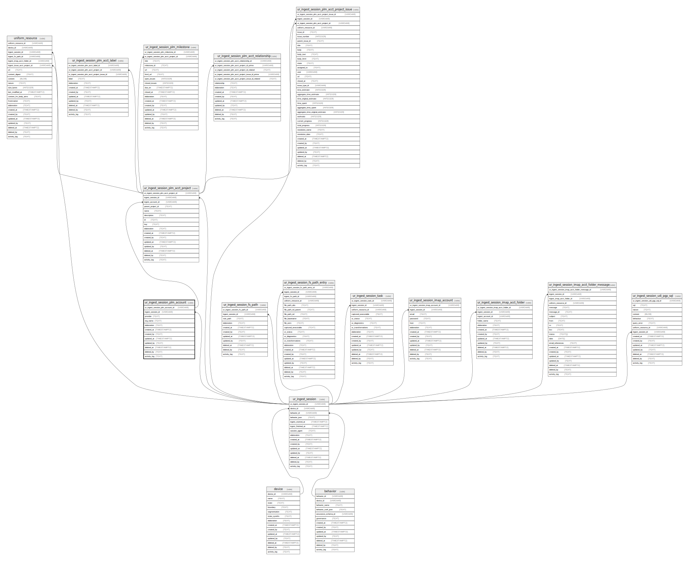

## Description

Immutable ingest session folder system represents an organisation issues to be
ingested. Each session includes an organisation, then org_name is the folder
that was scanned.

<details>
<summary><strong>Table Definition</strong></summary>

```sql
CREATE TABLE "ur_ingest_session_plm_account" (
    "ur_ingest_session_plm_account_id" VARCHAR PRIMARY KEY NOT NULL,
    "ingest_session_id" VARCHAR NOT NULL,
    "provider" TEXT NOT NULL,
    "org_name" TEXT NOT NULL,
    "elaboration" TEXT CHECK(json_valid(elaboration) OR elaboration IS NULL),
    "created_at" TIMESTAMPTZ DEFAULT CURRENT_TIMESTAMP,
    "created_by" TEXT DEFAULT 'UNKNOWN',
    "updated_at" TIMESTAMPTZ,
    "updated_by" TEXT,
    "deleted_at" TIMESTAMPTZ,
    "deleted_by" TEXT,
    "activity_log" TEXT,
    FOREIGN KEY("ingest_session_id") REFERENCES "ur_ingest_session"("ur_ingest_session_id"),
    UNIQUE("ingest_session_id", "org_name")
)
```

</details>

## Columns

| Name                             | Type        | Default           | Nullable | Children                                                                                                              | Parents                                                                             | Comment                                                 |
| -------------------------------- | ----------- | ----------------- | -------- | --------------------------------------------------------------------------------------------------------------------- | ----------------------------------------------------------------------------------- | ------------------------------------------------------- |
| ur_ingest_session_plm_account_id | VARCHAR     |                   | false    | [ur_ingest_session_plm_acct_project](/docs/standard-library/rssd-schema/ur_ingest_session_plm_acct_project) |                                                                                     | {"isSqlDomainZodDescrMeta":true,"isVarChar":true}       |
| ingest_session_id                | VARCHAR     |                   | false    |                                                                                                                       | [ur_ingest_session](/docs/standard-library/rssd-schema/ur_ingest_session) | {"isSqlDomainZodDescrMeta":true,"isVarChar":true}       |
| provider                         | TEXT        |                   | false    |                                                                                                                       |                                                                                     |                                                         |
| org_name                         | TEXT        |                   | false    |                                                                                                                       |                                                                                     |                                                         |
| elaboration                      | TEXT        |                   | true     |                                                                                                                       |                                                                                     | {"isSqlDomainZodDescrMeta":true,"isJsonText":true}      |
| created_at                       | TIMESTAMPTZ | CURRENT_TIMESTAMP | true     |                                                                                                                       |                                                                                     |                                                         |
| created_by                       | TEXT        | 'UNKNOWN'         | true     |                                                                                                                       |                                                                                     |                                                         |
| updated_at                       | TIMESTAMPTZ |                   | true     |                                                                                                                       |                                                                                     |                                                         |
| updated_by                       | TEXT        |                   | true     |                                                                                                                       |                                                                                     |                                                         |
| deleted_at                       | TIMESTAMPTZ |                   | true     |                                                                                                                       |                                                                                     |                                                         |
| deleted_by                       | TEXT        |                   | true     |                                                                                                                       |                                                                                     |                                                         |
| activity_log                     | TEXT        |                   | true     |                                                                                                                       |                                                                                     | {"isSqlDomainZodDescrMeta":true,"isJsonSqlDomain":true} |

## Constraints

| Name                                             | Type        | Definition                                                                                                                             |
| ------------------------------------------------ | ----------- | -------------------------------------------------------------------------------------------------------------------------------------- |
| ur_ingest_session_plm_account_id                 | PRIMARY KEY | PRIMARY KEY (ur_ingest_session_plm_account_id)                                                                                         |
| - (Foreign key ID: 0)                            | FOREIGN KEY | FOREIGN KEY (ingest_session_id) REFERENCES ur_ingest_session (ur_ingest_session_id) ON UPDATE NO ACTION ON DELETE NO ACTION MATCH NONE |
| sqlite_autoindex_ur_ingest_session_plm_account_2 | UNIQUE      | UNIQUE (ingest_session_id, org_name)                                                                                                   |
| sqlite_autoindex_ur_ingest_session_plm_account_1 | PRIMARY KEY | PRIMARY KEY (ur_ingest_session_plm_account_id)                                                                                         |
| -                                                | CHECK       | CHECK(json_valid(elaboration) OR elaboration IS NULL)                                                                                  |

## Indexes

| Name                                                           | Definition                                                                                                                                        |
| -------------------------------------------------------------- | ------------------------------------------------------------------------------------------------------------------------------------------------- |
| idx_ur_ingest_session_plm_account__ingest_session_id__org_name | CREATE INDEX "idx_ur_ingest_session_plm_account__ingest_session_id__org_name" ON "ur_ingest_session_plm_account"("ingest_session_id", "org_name") |
| sqlite_autoindex_ur_ingest_session_plm_account_2               | UNIQUE (ingest_session_id, org_name)                                                                                                              |
| sqlite_autoindex_ur_ingest_session_plm_account_1               | PRIMARY KEY (ur_ingest_session_plm_account_id)                                                                                                    |

## Relations


