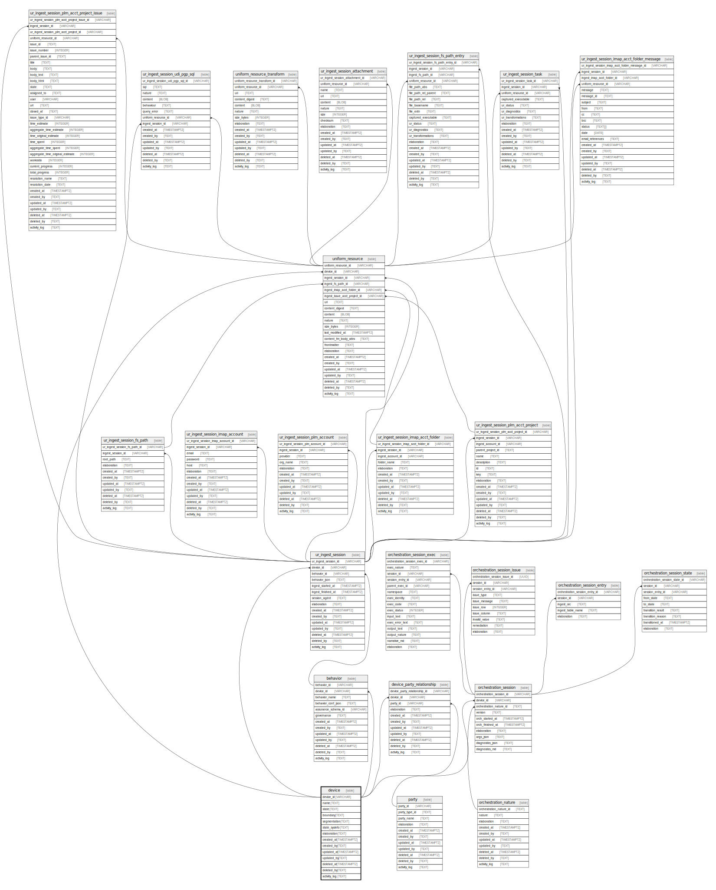

## Description

Identity, network segmentation, and sysinfo for devices on which
uniform_resource are found

<details>
<summary><strong>Table Definition</strong></summary>

```sql
CREATE TABLE "device" (
    "device_id" VARCHAR PRIMARY KEY NOT NULL,
    "name" TEXT NOT NULL,
    "state" TEXT CHECK(json_valid(state)) NOT NULL,
    "boundary" TEXT NOT NULL,
    "segmentation" TEXT CHECK(json_valid(segmentation) OR segmentation IS NULL),
    "state_sysinfo" TEXT CHECK(json_valid(state_sysinfo) OR state_sysinfo IS NULL),
    "elaboration" TEXT CHECK(json_valid(elaboration) OR elaboration IS NULL),
    "created_at" TIMESTAMPTZ DEFAULT CURRENT_TIMESTAMP,
    "created_by" TEXT DEFAULT 'UNKNOWN',
    "updated_at" TIMESTAMPTZ,
    "updated_by" TEXT,
    "deleted_at" TIMESTAMPTZ,
    "deleted_by" TEXT,
    "activity_log" TEXT,
    UNIQUE("name", "state", "boundary")
)
```

</details>

## Columns

| Name          | Type        | Default           | Nullable | Children                                                                                                                                                                                                                                                                                                                                                                                                                                | Comment                                                                                          |
| ------------- | ----------- | ----------------- | -------- | --------------------------------------------------------------------------------------------------------------------------------------------------------------------------------------------------------------------------------------------------------------------------------------------------------------------------------------------------------------------------------------------------------------------------------------- | ------------------------------------------------------------------------------------------------ |
| device_id     | VARCHAR     |                   | false    | [device_party_relationship](/docs/standard-library/rssd-schema/device_party_relationship) [behavior](/docs/standard-library/rssd-schema/behavior) [ur_ingest_session](/docs/standard-library/rssd-schema/ur_ingest_session) [uniform_resource](/docs/standard-library/rssd-schema/uniform_resource) [orchestration_session](/docs/standard-library/rssd-schema/orchestration_session) | {"isSqlDomainZodDescrMeta":true,"isVarChar":true}                                                |
| name          | TEXT        |                   | false    |                                                                                                                                                                                                                                                                                                                                                                                                                                         | unique device identifier (defaults to hostname)                                                  |
| state         | TEXT        |                   | false    |                                                                                                                                                                                                                                                                                                                                                                                                                                         | should be "SINGLETON" if only one state is allowed, or other tags if multiple states are allowed |
| boundary      | TEXT        |                   | false    |                                                                                                                                                                                                                                                                                                                                                                                                                                         | can be IP address, VLAN, or any other device name differentiator                                 |
| segmentation  | TEXT        |                   | true     |                                                                                                                                                                                                                                                                                                                                                                                                                                         | zero trust or other network segmentation                                                         |
| state_sysinfo | TEXT        |                   | true     |                                                                                                                                                                                                                                                                                                                                                                                                                                         | any sysinfo or other state data that is specific to this device (mutable)                        |
| elaboration   | TEXT        |                   | true     |                                                                                                                                                                                                                                                                                                                                                                                                                                         | any elaboration needed for the device (mutable)                                                  |
| created_at    | TIMESTAMPTZ | CURRENT_TIMESTAMP | true     |                                                                                                                                                                                                                                                                                                                                                                                                                                         |                                                                                                  |
| created_by    | TEXT        | 'UNKNOWN'         | true     |                                                                                                                                                                                                                                                                                                                                                                                                                                         |                                                                                                  |
| updated_at    | TIMESTAMPTZ |                   | true     |                                                                                                                                                                                                                                                                                                                                                                                                                                         |                                                                                                  |
| updated_by    | TEXT        |                   | true     |                                                                                                                                                                                                                                                                                                                                                                                                                                         |                                                                                                  |
| deleted_at    | TIMESTAMPTZ |                   | true     |                                                                                                                                                                                                                                                                                                                                                                                                                                         |                                                                                                  |
| deleted_by    | TEXT        |                   | true     |                                                                                                                                                                                                                                                                                                                                                                                                                                         |                                                                                                  |
| activity_log  | TEXT        |                   | true     |                                                                                                                                                                                                                                                                                                                                                                                                                                         | {"isSqlDomainZodDescrMeta":true,"isJsonSqlDomain":true}                                          |

## Constraints

| Name                      | Type        | Definition                                                |
| ------------------------- | ----------- | --------------------------------------------------------- |
| device_id                 | PRIMARY KEY | PRIMARY KEY (device_id)                                   |
| sqlite_autoindex_device_2 | UNIQUE      | UNIQUE (name, state, boundary)                            |
| sqlite_autoindex_device_1 | PRIMARY KEY | PRIMARY KEY (device_id)                                   |
| -                         | CHECK       | CHECK(json_valid(state))                                  |
| -                         | CHECK       | CHECK(json_valid(segmentation) OR segmentation IS NULL)   |
| -                         | CHECK       | CHECK(json_valid(state_sysinfo) OR state_sysinfo IS NULL) |
| -                         | CHECK       | CHECK(json_valid(elaboration) OR elaboration IS NULL)     |

## Indexes

| Name                      | Definition                                                          |
| ------------------------- | ------------------------------------------------------------------- |
| idx_device__name__state   | CREATE INDEX "idx_device__name__state" ON "device"("name", "state") |
| sqlite_autoindex_device_2 | UNIQUE (name, state, boundary)                                      |
| sqlite_autoindex_device_1 | PRIMARY KEY (device_id)                                             |

## Relations


