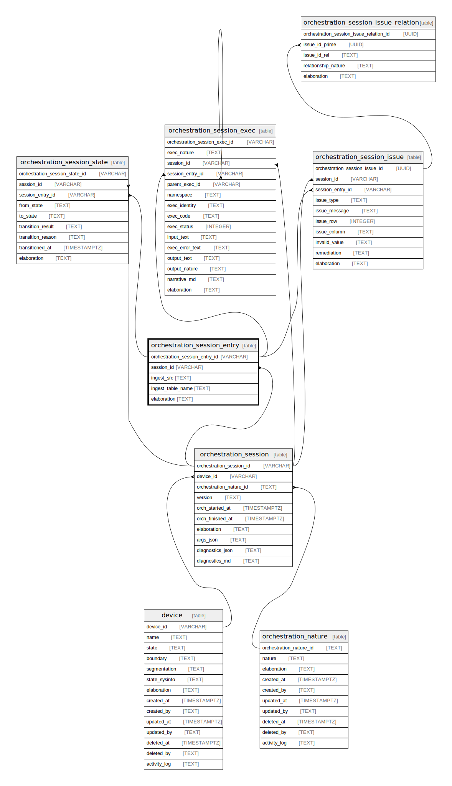

## Description

An orchestration session entry records a specific file that that is ingested or
otherwise orchestrated

<details>
<summary><strong>Table Definition</strong></summary>

```sql
CREATE TABLE "orchestration_session_entry" (
    "orchestration_session_entry_id" VARCHAR PRIMARY KEY NOT NULL,
    "session_id" VARCHAR NOT NULL,
    "ingest_src" TEXT NOT NULL,
    "ingest_table_name" TEXT,
    "elaboration" TEXT CHECK(json_valid(elaboration) OR elaboration IS NULL),
    FOREIGN KEY("session_id") REFERENCES "orchestration_session"("orchestration_session_id")
)
```

</details>

## Columns

| Name                           | Type    | Default | Nullable | Children                                                                                                                                                                                                                                                                                                              | Parents                                                                                     | Comment                                                                       |
| ------------------------------ | ------- | ------- | -------- | --------------------------------------------------------------------------------------------------------------------------------------------------------------------------------------------------------------------------------------------------------------------------------------------------------------------- | ------------------------------------------------------------------------------------------- | ----------------------------------------------------------------------------- |
| orchestration_session_entry_id | VARCHAR |         | false    | [orchestration_session_state](/docs/standard-library/rssd-schema/orchestration_session_state) [orchestration_session_exec](/docs/standard-library/rssd-schema/orchestration_session_exec) [orchestration_session_issue](/docs/standard-library/rssd-schema/orchestration_session_issue) |                                                                                             | orchestration_session_entry primary key and internal label (UUID)             |
| session_id                     | VARCHAR |         | false    |                                                                                                                                                                                                                                                                                                                       | [orchestration_session](/docs/standard-library/rssd-schema/orchestration_session) | orchestration_session row this entry describes                                |
| ingest_src                     | TEXT    |         | false    |                                                                                                                                                                                                                                                                                                                       |                                                                                             | The name of the file or URI of the source of the ingestion                    |
| ingest_table_name              | TEXT    |         | true     |                                                                                                                                                                                                                                                                                                                       |                                                                                             | If the ingestion was done into a temp or actual table, this is the table name |
| elaboration                    | TEXT    |         | true     |                                                                                                                                                                                                                                                                                                                       |                                                                                             | JSON governance data (description, documentation, usage, etc. in JSON)        |

## Constraints

| Name                                           | Type        | Definition                                                                                                                              |
| ---------------------------------------------- | ----------- | --------------------------------------------------------------------------------------------------------------------------------------- |
| orchestration_session_entry_id                 | PRIMARY KEY | PRIMARY KEY (orchestration_session_entry_id)                                                                                            |
| - (Foreign key ID: 0)                          | FOREIGN KEY | FOREIGN KEY (session_id) REFERENCES orchestration_session (orchestration_session_id) ON UPDATE NO ACTION ON DELETE NO ACTION MATCH NONE |
| sqlite_autoindex_orchestration_session_entry_1 | PRIMARY KEY | PRIMARY KEY (orchestration_session_entry_id)                                                                                            |
| -                                              | CHECK       | CHECK(json_valid(elaboration) OR elaboration IS NULL)                                                                                   |

## Indexes

| Name                                           | Definition                                   |
| ---------------------------------------------- | -------------------------------------------- |
| sqlite_autoindex_orchestration_session_entry_1 | PRIMARY KEY (orchestration_session_entry_id) |

## Relations


