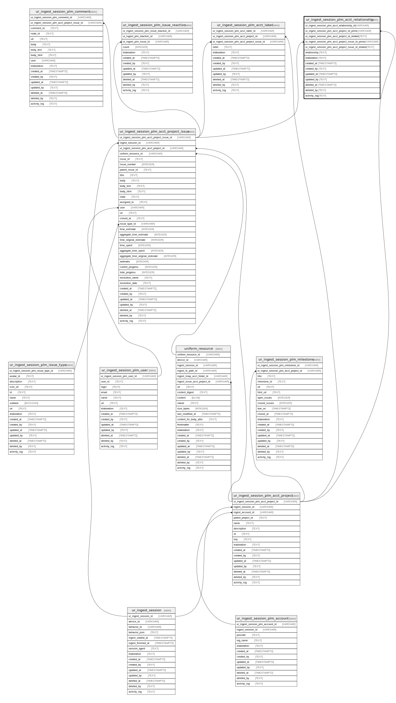

## Description

<details>
<summary><strong>Table Definition</strong></summary>

```sql
CREATE TABLE "ur_ingest_session_plm_acct_relationship" (
    "ur_ingest_session_plm_acct_relationship_id" VARCHAR PRIMARY KEY NOT NULL,
    "ur_ingest_session_plm_acct_project_id_prime" VARCHAR NOT NULL,
    "ur_ingest_session_plm_acct_project_id_related" TEXT NOT NULL,
    "ur_ingest_session_plm_acct_project_issue_id_prime" VARCHAR NOT NULL,
    "ur_ingest_session_plm_acct_project_issue_id_related" TEXT NOT NULL,
    "relationship" TEXT,
    "elaboration" TEXT CHECK(json_valid(elaboration) OR elaboration IS NULL),
    "created_at" TIMESTAMPTZ DEFAULT CURRENT_TIMESTAMP,
    "created_by" TEXT DEFAULT 'UNKNOWN',
    "updated_at" TIMESTAMPTZ,
    "updated_by" TEXT,
    "deleted_at" TIMESTAMPTZ,
    "deleted_by" TEXT,
    "activity_log" TEXT,
    FOREIGN KEY("ur_ingest_session_plm_acct_project_id_prime") REFERENCES "ur_ingest_session_plm_acct_project"("ur_ingest_session_plm_acct_project_id"),
    FOREIGN KEY("ur_ingest_session_plm_acct_project_issue_id_prime") REFERENCES "ur_ingest_session_plm_acct_project_issue"("ur_ingest_session_plm_acct_project_issue_id")
)
```

</details>

## Columns

| Name                                                | Type        | Default           | Nullable | Parents                                                                                                                           | Comment                                                 |
| --------------------------------------------------- | ----------- | ----------------- | -------- | --------------------------------------------------------------------------------------------------------------------------------- | ------------------------------------------------------- |
| ur_ingest_session_plm_acct_relationship_id          | VARCHAR     |                   | false    |                                                                                                                                   | {"isSqlDomainZodDescrMeta":true,"isVarChar":true}       |
| ur_ingest_session_plm_acct_project_id_prime         | VARCHAR     |                   | false    | [ur_ingest_session_plm_acct_project](/docs/standard-library/rssd-schema/ur_ingest_session_plm_acct_project)             | {"isSqlDomainZodDescrMeta":true,"isVarChar":true}       |
| ur_ingest_session_plm_acct_project_id_related       | TEXT        |                   | false    |                                                                                                                                   |                                                         |
| ur_ingest_session_plm_acct_project_issue_id_prime   | VARCHAR     |                   | false    | [ur_ingest_session_plm_acct_project_issue](/docs/standard-library/rssd-schema/ur_ingest_session_plm_acct_project_issue) | {"isSqlDomainZodDescrMeta":true,"isVarChar":true}       |
| ur_ingest_session_plm_acct_project_issue_id_related | TEXT        |                   | false    |                                                                                                                                   |                                                         |
| relationship                                        | TEXT        |                   | true     |                                                                                                                                   |                                                         |
| elaboration                                         | TEXT        |                   | true     |                                                                                                                                   | {"isSqlDomainZodDescrMeta":true,"isJsonText":true}      |
| created_at                                          | TIMESTAMPTZ | CURRENT_TIMESTAMP | true     |                                                                                                                                   |                                                         |
| created_by                                          | TEXT        | 'UNKNOWN'         | true     |                                                                                                                                   |                                                         |
| updated_at                                          | TIMESTAMPTZ |                   | true     |                                                                                                                                   |                                                         |
| updated_by                                          | TEXT        |                   | true     |                                                                                                                                   |                                                         |
| deleted_at                                          | TIMESTAMPTZ |                   | true     |                                                                                                                                   |                                                         |
| deleted_by                                          | TEXT        |                   | true     |                                                                                                                                   |                                                         |
| activity_log                                        | TEXT        |                   | true     |                                                                                                                                   | {"isSqlDomainZodDescrMeta":true,"isJsonSqlDomain":true} |

## Constraints

| Name                                                       | Type        | Definition                                                                                                                                                                                                           |
| ---------------------------------------------------------- | ----------- | -------------------------------------------------------------------------------------------------------------------------------------------------------------------------------------------------------------------- |
| ur_ingest_session_plm_acct_relationship_id                 | PRIMARY KEY | PRIMARY KEY (ur_ingest_session_plm_acct_relationship_id)                                                                                                                                                             |
| - (Foreign key ID: 0)                                      | FOREIGN KEY | FOREIGN KEY (ur_ingest_session_plm_acct_project_issue_id_prime) REFERENCES ur_ingest_session_plm_acct_project_issue (ur_ingest_session_plm_acct_project_issue_id) ON UPDATE NO ACTION ON DELETE NO ACTION MATCH NONE |
| - (Foreign key ID: 1)                                      | FOREIGN KEY | FOREIGN KEY (ur_ingest_session_plm_acct_project_id_prime) REFERENCES ur_ingest_session_plm_acct_project (ur_ingest_session_plm_acct_project_id) ON UPDATE NO ACTION ON DELETE NO ACTION MATCH NONE                   |
| sqlite_autoindex_ur_ingest_session_plm_acct_relationship_1 | PRIMARY KEY | PRIMARY KEY (ur_ingest_session_plm_acct_relationship_id)                                                                                                                                                             |
| -                                                          | CHECK       | CHECK(json_valid(elaboration) OR elaboration IS NULL)                                                                                                                                                                |

## Indexes

| Name                                                                                     | Definition                                                                                                                                                                                          |
| ---------------------------------------------------------------------------------------- | --------------------------------------------------------------------------------------------------------------------------------------------------------------------------------------------------- |
| idx_ur_ingest_session_plm_acct_relationship__ur_ingest_session_plm_acct_project_id_prime | CREATE INDEX "idx_ur_ingest_session_plm_acct_relationship__ur_ingest_session_plm_acct_project_id_prime" ON "ur_ingest_session_plm_acct_relationship"("ur_ingest_session_plm_acct_project_id_prime") |
| sqlite_autoindex_ur_ingest_session_plm_acct_relationship_1                               | PRIMARY KEY (ur_ingest_session_plm_acct_relationship_id)                                                                                                                                            |

## Relations


