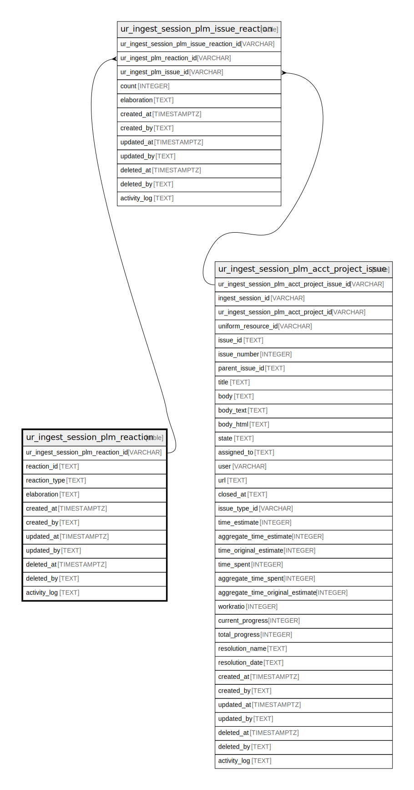

## Description

<details>
<summary><strong>Table Definition</strong></summary>

```sql
CREATE TABLE "ur_ingest_session_plm_reaction" (
    "ur_ingest_session_plm_reaction_id" VARCHAR PRIMARY KEY NOT NULL,
    "reaction_id" TEXT NOT NULL,
    "reaction_type" TEXT NOT NULL,
    "elaboration" TEXT CHECK(json_valid(elaboration) OR elaboration IS NULL),
    "created_at" TIMESTAMPTZ DEFAULT CURRENT_TIMESTAMP,
    "created_by" TEXT DEFAULT 'UNKNOWN',
    "updated_at" TIMESTAMPTZ,
    "updated_by" TEXT,
    "deleted_at" TIMESTAMPTZ,
    "deleted_by" TEXT,
    "activity_log" TEXT,
    UNIQUE("reaction_type")
)
```

</details>

## Columns

| Name                              | Type        | Default           | Nullable | Children                                                                                                                  | Comment                                                 |
| --------------------------------- | ----------- | ----------------- | -------- | ------------------------------------------------------------------------------------------------------------------------- | ------------------------------------------------------- |
| ur_ingest_session_plm_reaction_id | VARCHAR     |                   | false    | [ur_ingest_session_plm_issue_reaction](/docs/standard-library/rssd-schema/ur_ingest_session_plm_issue_reaction) | {"isSqlDomainZodDescrMeta":true,"isVarChar":true}       |
| reaction_id                       | TEXT        |                   | false    |                                                                                                                           |                                                         |
| reaction_type                     | TEXT        |                   | false    |                                                                                                                           |                                                         |
| elaboration                       | TEXT        |                   | true     |                                                                                                                           | {"isSqlDomainZodDescrMeta":true,"isJsonText":true}      |
| created_at                        | TIMESTAMPTZ | CURRENT_TIMESTAMP | true     |                                                                                                                           |                                                         |
| created_by                        | TEXT        | 'UNKNOWN'         | true     |                                                                                                                           |                                                         |
| updated_at                        | TIMESTAMPTZ |                   | true     |                                                                                                                           |                                                         |
| updated_by                        | TEXT        |                   | true     |                                                                                                                           |                                                         |
| deleted_at                        | TIMESTAMPTZ |                   | true     |                                                                                                                           |                                                         |
| deleted_by                        | TEXT        |                   | true     |                                                                                                                           |                                                         |
| activity_log                      | TEXT        |                   | true     |                                                                                                                           | {"isSqlDomainZodDescrMeta":true,"isJsonSqlDomain":true} |

## Constraints

| Name                                              | Type        | Definition                                            |
| ------------------------------------------------- | ----------- | ----------------------------------------------------- |
| ur_ingest_session_plm_reaction_id                 | PRIMARY KEY | PRIMARY KEY (ur_ingest_session_plm_reaction_id)       |
| sqlite_autoindex_ur_ingest_session_plm_reaction_2 | UNIQUE      | UNIQUE (reaction_type)                                |
| sqlite_autoindex_ur_ingest_session_plm_reaction_1 | PRIMARY KEY | PRIMARY KEY (ur_ingest_session_plm_reaction_id)       |
| -                                                 | CHECK       | CHECK(json_valid(elaboration) OR elaboration IS NULL) |

## Indexes

| Name                                                                  | Definition                                                                                                                                                    |
| --------------------------------------------------------------------- | ------------------------------------------------------------------------------------------------------------------------------------------------------------- |
| idx_ur_ingest_session_plm_reaction__ur_ingest_session_plm_reaction_id | CREATE INDEX "idx_ur_ingest_session_plm_reaction__ur_ingest_session_plm_reaction_id" ON "ur_ingest_session_plm_reaction"("ur_ingest_session_plm_reaction_id") |
| sqlite_autoindex_ur_ingest_session_plm_reaction_2                     | UNIQUE (reaction_type)                                                                                                                                        |
| sqlite_autoindex_ur_ingest_session_plm_reaction_1                     | PRIMARY KEY (ur_ingest_session_plm_reaction_id)                                                                                                               |

## Relations


